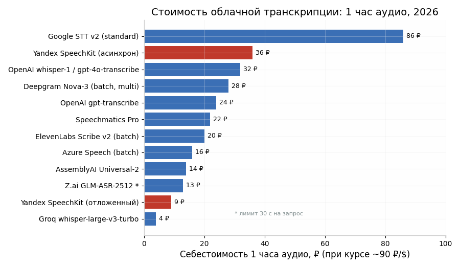
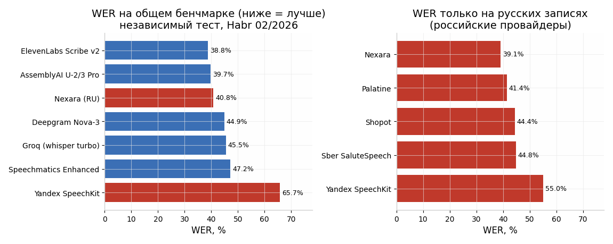
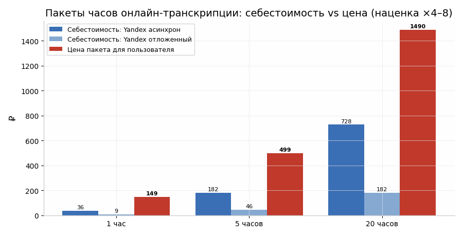
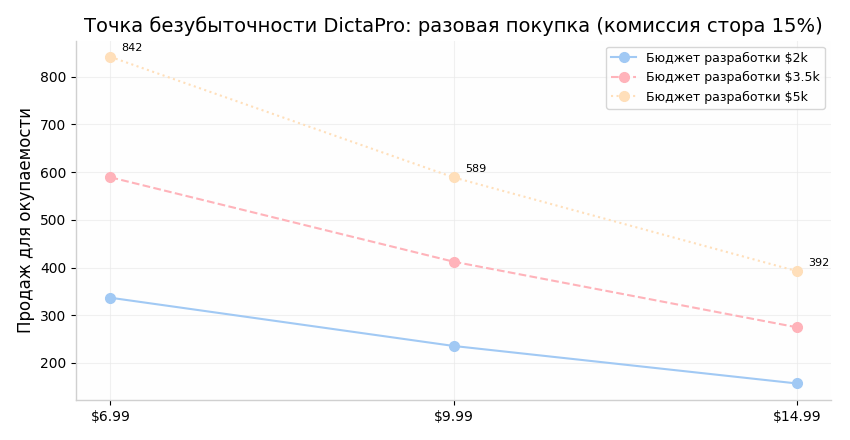

# DictaPro: онлайн-транскрипция русской речи, ИИ-саммари и монетизация — глубокое исследование

*Сентябрь 2026. Объект: Android-диктофон DictaPro (Flutter), офлайн-ядро VOSK + TextRank, планируется онлайн-слой с ключом пользователя (BYOK).*

## Резюме (TL;DR)

1. **Лучший онлайн-STT для русского из РФ — Yandex SpeechKit v3** (асинхронное распознавание файлов до 4 часов / 1 ГБ, оплата в рублях, без VPN, серверы в РФ). Себестоимость: ~36 ₽/час в стандартном асинхронном режиме и ~9 ₽/час в отложенном. Важный нюанс: в независимом русскоязычном бенчмарке (февраль 2026) SpeechKit показал WER заметно хуже лидеров, поэтому «основной по доступности» ≠ «самый точный».
2. **Самый дешёвый и быстрый — Groq (whisper-large-v3-turbo, $0.04/час)**, но требует иностранной карты для платного тира и чанкования (25 МБ на запрос). Free tier: 2000 запросов/день.
3. **Самый точный для русского по независимым тестам — ElevenLabs Scribe v2 и AssemblyAI**, но ElevenLabs официально ограничивает доступ из РФ.
4. **Z.ai**: ASR есть (GLM-ASR-2512, ~$0.14/час), но лимит 30 секунд на запрос и неподтверждённый русский делают его непригодным для часовых записей. Зато **Z.ai идеален для саммари: GLM-4.5-Flash и GLM-4.7-Flash бесплатны**, контекст 128K токенов покрывает 60-минутную встречу целиком.
5. **Рекомендуемая связка: Yandex SpeechKit (основной STT) + Groq (запасной STT) + Z.ai GLM-4.5-Flash (саммари, бесплатно)**. Себестоимость часа «транскрипт + саммари»: 9–40 ₽.
6. **Монетизация**: платное офлайн-приложение (~$9.99 разово или ~599–799 ₽) + пакеты онлайн-часов (1 ч ≈ 149 ₽, 5 ч ≈ 499 ₽, 20 ч ≈ 1490 ₽, наценка ×4–8) + BYOK как бесплатная опция для тех, у кого свой ключ. Окупаемость при бюджете разработки $3.5–5k: ~420–590 продаж.

---

## 1. Сравнительная таблица STT-провайдеров

| Провайдер | Русский: качество | Цена за минуту | Пунктуация | Диаризация | Макс. длина / файл | Доступность из РФ | Оплата из РФ | Вердикт |
|---|---|---|---|---|---|---|---|---|
| **Yandex SpeechKit v3** | Хорошее, но в независимом тесте WER 0.55–0.66 — хуже лидеров ([Habr](https://habr.com/ru/articles/993786/)); на практике сильнейший в РФ по отзывам бизнеса ([vc.ru](https://vc.ru/id705136/2921075-golosovoy-ii-dlya-biznesa-nevroseti-dlya-koll-tsentrov)) | 0,61 ₽/мин асинхрон; 0,15 ₽/мин отложенный ([Yandex](https://aistudio.yandex.ru/ru/docs/speechkit/pricing)) | Да | Да (многоканальные файлы) | **4 часа / 1 ГБ** ([Yandex](https://aistudio.yandex.ru/ru/docs/speechkit/stt/transcribation)) | ✅ Полная, без VPN | ✅ Рубли, карта РФ, счёт для юрлиц | **Основной для РФ** |
| **Groq (whisper-large-v3-turbo)** | Whisper large-v3: WER ~9.8% на Common Voice RU; turbo теряет +2–4 п.п. на русском ([novascribe](https://novascribe.ai/whisper-large-v3-vs-turbo), [HF](https://huggingface.co/antony66/whisper-large-v3-russian)) | **$0.0007/мин** ($0.04/час); large-v3 — $0.00185/мин ([CloudZero](https://www.cloudzero.com/blog/groq-pricing/)) | Да (встроенная) | Нет | 25 МБ free / 100 МБ dev; мин. биллинг 10 с ([Groq Docs](https://console.groq.com/docs/speech-to-text)) | ⚠️ Официально РФ не блокируется, но гео-риск есть | ❌ Нужна иностранная карта; free tier без карты | **Запасной / BYOK-вариант** |
| **OpenAI (whisper-1, gpt-4o-transcribe)** | gpt-4o-transcribe — лучший WER на FLEURS по тестам OpenAI, лидер в независимых тестах ([Deepgram](https://deepgram.com/learn/deepgram-vs-openai-vs-google-stt-accuracy-latency-price-compared)); новый gpt-transcribe снижает ошибки на 52% vs whisper-1 ([AlphaSignal](https://alphasignal.ai/news/openai-replaces-whisper-with-gpt-transcribe-slashing-errors-by-52)) | $0.006/мин (whisper-1, gpt-4o); $0.0045 (gpt-transcribe); $0.003 (mini) ([DIY AI](https://diyai.io/ai-tools/speech-to-text/openai-whisper-api-pricing-2026/)) | Да | Только в gpt-4o-transcribe-diarize (тот же $0.006/мин) | 25 МБ / запрос | ❌ **Блокировка IP РФ с 2024, аккаунты банятся** ([vc.ru](https://vc.ru/provod/2962649-openai-api-v-rossii-kak-rabotat-bez-vpn)) | ❌ Только через посредников/зарубежные карты | Только BYOK у пользователя с зарубежным аккаунтом |
| **Deepgram Nova-3** | Русский поддержан официально с Nova-3 (в т.ч. code-switching) ([Deepgram](https://deepgram.com/learn/nova-3-multilingual-major-wer-improvements-across-languages)); в RU-бенчмарке WER 0.449 ([Habr](https://habr.com/ru/articles/993786/)) | $0.0043/мин batch mono, $0.0052 multi ([BrassTranscripts](https://brasstranscripts.com/blog/deepgram-pricing-per-minute-2025-real-time-vs-batch)) | Да (Smart Formatting включён) | +$0.002/мин (streaming); в batch включена | До ~2 ГБ (async) | ⚠️ Не заблокирован, но оплата — барьер | ❌ Иностранная карта; $200 стартовых кредитов | Хороший запасной для BYOK |
| **AssemblyAI Universal-2 / 3.5 Pro** | 99 языков, русский есть; в RU-тесте WER 0.40–0.42 — второе место после Scribe ([Habr](https://habr.com/ru/articles/993786/)) | $0.0025/мин (U-2), $0.0035 (3.5 Pro) ([AssemblyAI](https://www.assemblyai.com/blog/speech-to-text-api-pricing)) | Да | +$0.02/час | До ~10 ч (async) | ⚠️ Не заблокирован | ❌ Иностранная карта; $50 кредитов | Сильный BYOK-вариант |
| **ElevenLabs Scribe v2** | **Лучший WER 0.388 в независимом RU-тесте** ([Habr](https://habr.com/ru/articles/993786/)) | $0.00367/мин batch; $0.0065 realtime ([HappyRobot](https://www.happyrobot.ai/hub/deepgram-pricing)) | Да | Только в batch | Крупные файлы | ❌ **Россия в официальном списке ограниченных стран** ([vc.ru](https://vc.ru/services/3053936-sposoby-oplaty-elevenlabs-v-rossii)) | ❌ Посредники/зарубежная карта | Технически лучший, но рискованный |
| **Speechmatics** | 55+ языков, русский есть; WER 0.472 (Enhanced) ([Habr](https://habr.com/ru/articles/993786/)) | ~$0.004/мин (Pro, $0.24/час) ([checkthat.ai](https://checkthat.ai/brands/speechmatics)) | Да | Да | Без жёсткого лимита | ⚠️ Enterprise-фокус | ❌ Иностранная карта | Избыточен для B2C |
| **Google Cloud STT v2** | Chirp поддерживает русский; качество высокое | $0.016/мин standard; **$0.003/мин dynamic batch** ([smallest.ai](https://smallest.ai/blog/is-google-cloud-speech-to-text-still-the-right-choice)) | Да | +$0.006/мин | Длинные файлы (batch) | ⚠️ Оплата GCP из РФ закрыта | ❌ | Не для РФ |
| **Azure Speech** | 100+ языков, русский есть | $0.003/мин batch (диаризация включена), $0.0167/мин realtime ([Azure](https://azure.microsoft.com/en-us/pricing/details/speech/)) | Да | Включена в batch | Длинные файлы | ⚠️ Новые подписки Azure из РФ ограничены | ❌ | Не для РФ |
| **Z.ai GLM-ASR-2512** | Русский **не заявлен** (фокус: китайский/английский + «десятки языков») ([Z.ai Docs](https://docs.z.ai/guides/audio/glm-asr-2512)) | ~$0.0024/мин ($0.03/MTok) ([Z.ai Pricing](https://docs.z.ai/guides/overview/pricing)) | Да | Нет | **⚠️ 30 секунд / 25 МБ на запрос** ([Z.ai Docs](https://docs.z.ai/api-reference/audio/audio-transcriptions)) | ✅ Работает (у пользователя есть аккаунт) | ⚠️ Карта РФ напрямую не проходит, но баланс уже есть | **Не подходит для длинных записей** |
| **Российские нишевые (Nexara, Palatine, Sber SaluteSpeech)** | Nexara — лучший WER 0.391 на русском в тесте, быстрее всех ([Habr](https://habr.com/ru/articles/993786/)) | Nexara ~0,36 ₽/мин; Sber ~0,6 ₽/мин | Да | У Nexara/Sber есть | Варьируется | ✅ Полная | ✅ Рубли | **Перспективная альтернатива Yandex** |



---

## 2. Качество русского: что показывают независимые тесты

Самый свежий независимый русскоязычный бенчмарк (Habr, февраль 2026, реальные записи) расставил провайдеров так: **ElevenLabs Scribe v2 (WER 0.388) → AssemblyAI (0.397–0.416) → Nexara (0.408) → Deepgram Nova-3 (0.449) → Groq turbo (0.455) → Speechmatics Enhanced (0.472) → Yandex SpeechKit (0.657)** ([Habr](https://habr.com/ru/articles/993786/)). На подмножестве чисто русских записей среди российских провайдеров лидирует Nexara (0.391), Yandex — последний (0.550). Это контринтуитивный, но важный результат: «домашний» провайдер по метрике ошибок проигрывает и западным API, и российским стартапам.

Однако у WER-бенчмарков есть оговорки. Во-первых, тест Habr мал (ограниченный набор записей) и измеряет «сырой» WER на сложном аудио — абсолютные значения 39–66% отражают жёсткость теста, а не то, что «треть слов неправильная» на диктофонной записи. Во-вторых, для сценария «пользователь диктует мысли/лекции на телефон» решающими являются устойчивость к разговорной речи, расстановка пунктуации и форматирование (formatted WER), где модели уровня gpt-4o-transcribe и Scribe v2 исторически сильнее ([Deepgram](https://deepgram.com/learn/deepgram-vs-openai-vs-google-stt-accuracy-latency-price-compared)). В-третьих, Yandex выигрывает вне метрик: стабильность доступа, юридическая чистота (152-ФЗ, серверы в РФ), оплата в рублях и отсутствие риска внезапной блокировки аккаунта пользователя ([vc.ru](https://vc.ru/id705136/2921075-golosovoy-ii-dlya-biznesa-nevroseti-dlya-koll-tsentrov)).

Практический вывод для DictaPro: **делать слой онлайн-STT провайдеро-независимым (абстракция с выбором провайдера в настройках)**, дефолтом для российского пользователя ставить Yandex SpeechKit (возможно, Nexara после теста), а для BYOK-пользователей предлагать OpenAI / Groq / Deepgram / AssemblyAI. Качество конкретного провайдера на «вашем» аудио (диктофон, 16 кГц, один спикер) обязательно проверить собственным мини-бенчмарком из 10–20 записей — это дешевле любой ошибки выбора.



---

## 3. Рекомендация: топ-2 для русского + расчёт стоимости

**Основной — Yandex SpeechKit v3 (асинхронное распознавание файлов).** Причины: единственный топовый провайдер, полностью работающий из РФ без VPN и с оплатой в рублях; файлы до 4 часов и 1 ГБ покрывают сценарий 5–60 минут без чанкования ([Yandex](https://aistudio.yandex.ru/ru/docs/speechkit/stt/transcribation)); посекундная тарификация с 16-й секунды; скорость ~10 секунд обработки на минуту аудио. Цена: стандартный асинхрон **0,1515 ₽ за 15 с ≈ 36,4 ₽/час (~$0.40)**; отложенный режим (очередь с низким приоритетом, обработка до 24 ч) **0,0381 ₽ за 15 с ≈ 9,1 ₽/час (~$0.10)** ([Yandex Pricing](https://aistudio.yandex.ru/ru/docs/speechkit/pricing)). Отложенный режим идеален для кнопки «Точный транскript (в фоне)» — пользователю не критично ждать, а себестоимость падает в 4 раза.

**Запасной — Groq whisper-large-v3-turbo.** Причины: самая низкая цена в индустрии — **$0.04/час (~3,6 ₽/час)**, скорость ~200× реального времени (час аудио за ~16 секунд), OpenAI-совместимый endpoint (минимум кода), free tier 2000 запросов/день позволяет тестировать бесплатно ([CloudZero](https://www.cloudzero.com/blog/groq-pricing/), [Groq Docs](https://console.groq.com/docs/speech-to-text)). Ограничения: 25 МБ на запрос (для часовой записи в m4a/ogg это впритык — нужно сжатие или чанкование), минимальный биллинг 10 секунд на запрос, нет диаризации, оплата только иностранной картой, и политический риск: Groq — американская компания, и хотя официальной блокировки РФ нет, прецедент OpenAI (массовое закрытие аккаунтов в июле 2024) показывает, как это может закончиться ([vc.ru](https://vc.ru/provod/2962649-openai-api-v-rossii-kak-rabotat-bez-vpn)).

**Себестоимость 1 часа аудио с саммари** (саммари: 13k входных + 1k выходных токенов, GLM-4.5-Flash — бесплатно, берём GLM-4.7 за $0.01 как верхнюю оценку):

| Вариант | STT за час | Саммари | Итого за час |
|---|---|---|---|
| Yandex отложенный + GLM-4.5-Flash | 9,1 ₽ | 0 ₽ | **≈ 9–10 ₽** |
| Yandex асинхрон + GLM-4.5-Flash | 36,4 ₽ | 0 ₽ | **≈ 37 ₽** |
| Groq turbo + GLM-4.5-Flash | 3,6 ₽ | 0 ₽ | **≈ 4–5 ₽** |
| OpenAI gpt-4o-transcribe + GPT-4o-mini | 32 ₽ | ~0,25 ₽ | ≈ 33 ₽ (но недоступен из РФ напрямую) |

---

## 4. Сравнение с офлайном: VOSK и whisper.cpp на телефоне

### 4.1 VOSK против облака

Большая русская модель VOSK (vosk-model-ru-0.42, 1.8 ГБ) показывает WER **4.5% на аудиокнигах, 11.1% на open_stt audiobooks, 19.5% на YouTube и 36% на телефонных звонках** ([VOSK Models](https://alphacephei.com/vosk/models)). Малая модель (которая сейчас в DictaPro) заметно хуже — по оценкам сообщества разрыв с большой составляет 1.5–2× по ошибкам. Для сравнения: облачный whisper-large-v3 даёт на русском ~9.8% на Common Voice ([Hugging Face](https://huggingface.co/antony66/whisper-large-v3-russian)), а файнтюн под русский снижает WER до 6.4%. То есть **большая модель VOSK на чистой речи конкурентна, но на «живом» аудио (шум, дальний микрофон, перебивания) проигрывает облаку в 1.5–3 раза**, и критически уступает в пунктуации (rule-based) и отсутствии диаризации. Вывод: оставить VOSK как мгновенный бесплатный слой — правильно; позиционировать онлайн как «идеальное качество» — честно.

### 4.2 Реалистичен ли офлайн-Whisper на Android?

Короткий ответ: для пакетной обработки — да, для стриминга в реальном времени — почти нет. На ARM-платформе уровня RK3588 (близко к среднему Android) whisper.cpp даёт RTF: tiny ~10× быстрее реального времени (299 МБ RAM), base ~6×, **small ~2× (889 МБ RAM)**, medium уже 1.51× медленнее реального времени и 2.1 ГБ RAM ([Turing Pi](https://turingpi.com/whisper-cpp-piper-tts-arm64-turing-pi-rk3588/)). На реальных смартфонах с термотроттлингом цифры хуже; практика разработчиков подтверждает: batch-режим «записал → обработал» работает отлично, а живой стриминг даже с tiny-моделью уходит в нарастающие задержки и ANR ([Reddit](https://www.reddit.com/r/androiddev/comments/1po663c/whispercpp_on_android_streaming_live/)). Качество small на русском, впрочем, будет заметно лучше малой модели VOSK.

Рекомендация: **опциональный офлайн-режим «улучшенный транскрипт в фоне» на whisper.cpp small/base (скачиваемая модель ~140–470 МБ)** — бесплатный апгрейд качества без облака, обработка ночью/на зарядке. Это уникальная фича против конкурентов и не отменяет онлайн-слой: whisper small всё равно уступает large-v3/Scribe по русскому.

---

## 5. ИИ-саммари: подходы, стоимость, промпт

### 5.1 Как делают лидеры

Otter.ai, Fireflies и Granola используют одну и ту же трёхслойную схему: захват аудио → транскрипция с диаризацией и таймкодами → LLM- суммаризация в структурированный формат. Fireflies отделяет решения от задач, привязывает задачи к владельцам и датам и даёт ссылки на таймкоды записи; предлагает 200+ шаблонов под тип встречи (продажи, интервью, продукт) ([Fireflies](https://fireflies.ai/blog/automated-meeting-notes)). Granola пошла дальше: пользователь пишет черновые пометки во время встречи, а AI достраивает их транскриптом — так саммари отражает то, что важно именно пользователю, а не «средний» пересказ ([Granola](https://www.granola.ai/blog/can-ai-record-meeting-minutes-yes-and-heres-how-with-caveats)). Эту идею DictaPro может скопировать почти бесплатно: поле «заметки во время записи» → добавляется в промпт как приоритетный контекст.

### 5.2 Стоимость саммари 60-минутной встречи

Час речи ≈ 10 тыс. слов ≈ 13 тыс. токенов на входе; структурированное саммари ≈ 0.5–1.5 тыс. токенов на выходе. Расчёт по актуальным ценам:

| Модель | Вход ($/1M) | Выход ($/1M) | Цена саммари 1 часа | Контекст |
|---|---|---|---|---|
| **GLM-4.5-Flash / GLM-4.7-Flash (Z.ai)** | **$0** | **$0** | **$0.00** | 128K |
| GLM-5.3-Flash | $0.08 | $0.25 | ~$0.0013 | 1M |
| GLM-4.5-Air | $0.20 | $1.10 | ~$0.0037 | 128K |
| GLM-4.7 | $0.60 | $2.20 | ~$0.0100 | 200K |
| GPT-4o-mini (для справки) | $0.15 | $0.60 | ~$0.0025 | 128K |

Цены — по официальному прайсу Z.ai ([docs.z.ai](https://docs.z.ai/guides/overview/pricing), [Puter](https://developer.puter.com/tutorials/zai-glm-api-pricing/)). **Вывод: саммари на Z.ai фактически бесплатно** (GLM-4.5-Flash и GLM-4.7-Flash — $0 за токены), а контекст 128K токенов вмещает ~6 часов транскрипта целиком — map-reduce для записей до 60 минут не нужен вообще. У пользователя уже есть аккаунт Z.ai с балансом — нулевое трение.

Map-reduce имеет смысл только для записей >4–6 часов: режем транскрипт на чанки по 20–30 минут с перекрытием ~200 токенов, суммируем каждый, затем суммируем суммари (2 уровня). На бесплатных Flash-моделях даже это стоит $0.

### 5.3 Готовая структура промпта (RU)

Собрана из практик AssemblyAI (структура «решения/задачи/темы/следующие шаги») ([AssemblyAI](https://www.assemblyai.com/blog/summarize-meetings-llms-python)) и Fireflies (владельцы задач, дедлайны, отделение решений):

```
РОЛЬ: Ты — профессиональный аналитик встреч. Извлекай только то,
что реально прозвучало в транскрипте. Если элемента нет — напиши
«не обсуждалось», ничего не выдумывай.

ЗАМЕТКИ ПОЛЬЗОВАТЕЛЯ (приоритетный контекст, если есть):
{user_notes}

ТИП ЗАПИСИ: {встреча | лекция | личные мысли}

СТРУКТУРА ОТВЕТА (Markdown):
## Обзор
— дата/длительность, участники (если названы), главная цель, 2–3 предложения.
## Ключевые решения
— каждое решение отдельным пунктом; сроки и цифры, если прозвучали.
## Задачи (action items)
— [ ] задача — владелец — срок (если указан) — зависимости.
## Основные темы
— по каждой теме: 1–2 тезиса, спорные моменты, открытые вопросы.
## Имена, даты, числа
— списком всё упомянутое существенное.
## Следующие шаги
— договорённости о следующей встрече, что подготовить.

Для типа «лекция»: вместо решений/задач — «Конспект по разделам»
и «Термины и определения». Для «мыслей» — «Ядро идеи» и «Что развить».
```

Для длинных записей добавляется map-шаг: тот же промпт на чанк + инструкция «это часть N из M, не делай общих выводов», затем reduce-шаг со сводным промптом.

---

## 6. Z.ai: специфика

**ASR.** У Z.ai/bigmodel с конца 2025 есть модель распознавания **GLM-ASR-2512**: цена $0.03 за 1M токенов, что эквивалентно примерно **$0.0024/минуту (~$0.14/час)** ([docs.z.ai](https://docs.z.ai/guides/overview/pricing)). Модель позиционируется как многоязычная с CER 0.0717, но в документации явно перечислены китайский (с диалектами) и английский, остальные — «десятки глобальных языков» без гарантии русского ([docs.z.ai](https://docs.z.ai/guides/audio/glm-asr-2512)). Критичное ограничение: **≤ 30 секунд аудио и ≤ 25 МБ на запрос** — модель создана для голосового ввода, а не для часовых записей ([docs.z.ai](https://docs.z.ai/api-reference/audio/audio-transcriptions)). Чанкование часовой записи на 120 кусков по 30 секунд технически возможно (цена останется ~13 ₽/час), но без диаризации, с потерей контекста на границах и непроверенным русским качеством это худший из рассмотренных вариантов. Вердикт: GLM-ASR — не для DictaPro, кроме, возможно, коротких голосовых заметок <30 с.

**Саммари.** GLM-4.5-Flash (128K контекст) и GLM-4.7-Flash полностью бесплатны в API — это лучшее предложение на рынке для суммаризации на 2026 год ([docs.z.ai](https://docs.z.ai/guides/overview/pricing), [Puter](https://developer.puter.com/tutorials/zai-glm-api-pricing/)). Для саммари премиум-качества — GLM-4.7 ($0.60/$2.20 за 1M, ~1 цента за часовую встречу). Оплата из РФ: российская карта напрямую не проходит (нет 3-D Secure на стороне Z.ai, BIN-фильтр), работают посредники и зарубежные карты; у пользователя баланс уже есть, поэтому для него вопрос закрыт ([vc.ru](https://vc.ru/services/3015501-kak-oplatit-zai-iz-rossii)).

**Риски Z.ai:** серверы в Китае (данные аудио/транскриптов уходят за границу — дисклеймер в политике приватности приложения обязателен), бесплатные тарифы Flash могут стать платными (прецедент: GLM-5.3-Flash уже платный), рейт-лимиты free-моделей не публичны.

---

## 7. Гибридная архитектура DictaPro

Рекомендуемая схема «офлайн по умолчанию + онлайн по кнопке»:

1. **Офлайн-слой (бесплатно, мгновенно):** VOSK small — как сейчас. Опционально: загружаемый whisper.cpp small/base для фоновой «улучшенной» обработки без сети (см. §4.2).
2. **Кнопка «Точный транскрипт (онлайн)»:** выбор провайдера в настройках (Yandex по умолчанию для РФ; Groq/Deepgram/AssemblyAI/OpenAI — BYOK). Ключ хранится в SharedPreferences/EncryptedSharedPreferences — как уже сделано для Z.ai.
3. **Пайплайн онлайн-запроса:**
   - Оценка стоимости до отправки: длительность × тариф → показать пользователю («~36 ₽, спишется с вашего баланса Yandex Cloud» / «бесплатно по вашему ключу»).
   - Подготовка аудио: конвертация в ogg/m4a 16 кГц моно (час ≈ 15–30 МБ — проходит лимиты Yandex 1 ГБ без чанкования; для Groq/OpenAI с лимитом 25 МБ — нарезка на чанки по 10–15 минут с перекрытием 5 с и склейкой по таймкодам).
   - Загрузка с resume, экспоненциальные ретраи (3 попытки: 2с/10с/30с), обработка 429/5xx, polling статуса асинхронной операции (Yandex возвращает operation id; результаты хранятся 3 суток).
   - Прогресс: детерминированный для загрузки (проценты), индикативный для обработки («~1 мин на 10 мин аудио»).
4. **Саммари:** после транскрипции → GLM-4.5-Flash (ключ Z.ai уже есть) → кэшировать результат рядом с транскриптом, чтобы не пересчитывать.
5. **Fallback-цепочка:** основной провайдер недоступен → предложить запасной → офлайн VOSK уже есть как дно.

Расходы при **10 записях/неделю по 30 минут (~21,6 часа/мес)** на одного активного пользователя: Yandex асинхрон ~787 ₽/мес, Yandex отложенный ~197 ₽/мес, Groq ~78 ₽/мес — при BYOK всё это платит сам пользователь напрямую провайдеру, DictaPro несёт нулевую себестоимость. Именно поэтому BYOK должен остаться бесплатной фичей, а монетизироваться — удобство (пакеты часов «под ключ» для тех, кто не хочет заводить ключи).

---

## 8. Монетизация и юнит-экономика (Блок F)

### 8.1 Модели оплаты в категории «диктофон/заметки»

Категория доказала жизнеспособность обеих моделей. **Just Press Record** — разовая покупка $4.99–6.99, без подписки, успешный продукт с полной приватностью ([speakwiseapp](https://speakwiseapp.com/blog/just-press-record-vs-voice-memos), [usevoicy](https://usevoicy.com/comparisons/voicy-vs-just-press-record)). **Notability** — freemium: бесплатные заметки + подписка Plus $19.99/год и Pro $99.99/год, есть разовая Classic-опция $49.99 ([paperlike](https://paperlike.com/blogs/paperlikers-insights/app-review-goodnotes-vs-notability)). **Goodnotes** — $11.99–35.99/год + AI Pass $9.99/мес, плюс разовая Special Edition ([goodnotes.com](https://www.goodnotes.com/pricing)). Паттерн 2026 года: **база продаётся разово или дёшево, AI-фичи — подпиской**, потому что у AI есть регулярная себестоимость. Комиссия Google Play: 15% с первого $1M выручки для подписок и малых разработчиков, до 30% далее; в 2026 Google дополнительно снижает ставки (20% для новых установок в ЕЭЗ/США/UK) ([sud.ua](https://sud.ua/ru/news/abroad/355043-google-play-izmenil-pravila-dlya-razrabotchikov-i-snizil-komissii), [artean](https://artean.ru/blog/mobilnie-prilojeniya/skolko-stoit-opublikovat-prilozhenie-v-google-play-aktualnye-tseny-i-komissii/)).

### 8.2 Цены онлайн-конкурентов (за час транскрипции)

| Сервис | Цена | Эффективная цена за час |
|---|---|---|
| Otter.ai Pro | $8.33/мес (годовая), 1200 мин | ~$0.42/час при полном использовании ([sonix](https://sonix.ai/resources/otter-ai-pricing/)) |
| Notta Pro | ~$8/мес, ~1800 мин | ~$0.27/час ([hypescribe](https://www.hypescribe.com/blog/best-ai-transcription-tools-in-2026-some-good-options-compared)) |
| TurboScribe Unlimited | ~$10/мес, безлимит | → ~$0 при объёме |
| Rev AI | $0.25/мин | $15/час (!) |
| Fireflies Pro | $10/мес (годовая), безлимит | → ~$0 |

Важно: Otter не поддерживает русский вообще (только EN/ES/FR + ещё несколько) ([sonix](https://sonix.ai/resources/otter-ai-pricing/)) — **русскоязычная ниша онлайн-транскрипции встреч на Android фактически пуста**, западные подписочные сервисы её не закрывают. Это подтверждает стратегию «мы не конкурируем с ними, мы закрываем то, что они не закрывают».

### 8.3 Юнит-экономика онлайн-слоя (пакеты часов)

Себестоимость (Yandex асинхрон 36,4 ₽/ч + саммари ~0 ₽), наценка ×4–8 с учётом комиссии стора 15% и возвратов (~5%):

| Пакет | Себестоимость | Цена | Доход после комиссии 15% | Маржа |
|---|---|---|---|---|
| 1 час | 36 ₽ | **149 ₽** | 127 ₽ | ~3,5× |
| 5 часов | 182 ₽ | **499 ₽** | 424 ₽ | ~2,3× |
| 20 часов | 728 ₽ | **1490 ₽** | 1267 ₽ | ~1,7× |

Для отложенного режима Yandex (9 ₽/час) маржа вырастает до ×4–16 — можно сделать «фоновые пакеты» дешевле (99/349/999 ₽) с доставкой транскрипта в течение суток. Подписка-вариант: **299 ₽/мес с включёнными 3 часами** (себестоимость ~110 ₽, комиссия на подписки 15%) — для регулярных пользователей; перевес в пользу пакетов, если пользователь нестабилен.



### 8.4 Что оправдывает $10–15 разово

Анализ Just Press Record ($6.99), Voicy ($260 lifetime!), Goodnotes Special Edition показывает: разовую цену $10+ оправдывают **приватность (всё на устройстве), отсутствие подписки как ценность само по себе, надёжность записи (crash-safe), экспорт без ограничений и «бесшовность»** ([usevoicy](https://usevoicy.com/comparisons/voicy-vs-just-press-record)). Набор DictaPro (запись + офлайн-транскрипт VOSK + пунктуация + TextRank-саммари + опциональный whisper.cpp-апгрейд + BYOK-онлайн) укладывается в это позиционирование; главный маркетинговый тезис против Otter/Notta: «без подписки, без облака, с русским языком».

### 8.5 Рекомендованная модель монетизации

1. **Free tier:** запись + VOSK-транскрипт с лимитом (например, 10 записей или 3 часа офлайн-транскрипции), водяной знак на экспорте саммари.
2. **DictaPro Pro — разовая 799 ₽ (~$9.99):** полный офлайн без лимитов, whisper.cpp-апгрейд, BYOK-поддержка (Z.ai/Yandex/Groq ключи), экспорт. Ориентир по рынку: Just Press Record $6.99, Notability Classic $49.99.
3. **Пакеты онлайн-часов (IAP):** 149/499/1490 ₽ — для тех, кому нужно облачное качество без возни с ключами.
4. **Подписка 299 ₽/мес (3 часа включено)** — опционально, позже, когда будет статистика конверсии пакетов.

**Точка безубыточности** (бюджет разработки $2–5k, комиссия 15%, чистыми с продажи 799 ₽ ≈ $7.5): **~265–665 продаж**; при бюджете $3.5k и цене $9.99 — ~550 продаж ([расчёт ниже](#chart-breakeven)). Пакеты часов сокращают этот срок: один активный онлайн-пользователь приносит дополнительно ~100–300 ₽ маржи в месяц.



---

## 9. Риски

1. **Рост цен провайдеров.** Цены на STT за 2024–2026 стабильно снижались (Whisper-эффект), обратного тренда нет; риск умеренный. Хеджирование: абстракция провайдеров + отложенный тариф Yandex как «якорь себестоимости».
2. **Закрытие API из РФ.** OpenAI уже закрыл (июль 2024), ElevenLabs официально ограничивает, OpenRouter начал блокировать российские аккаунты в мае–июне 2026 ([sostav](https://www.sostav.ru/blogs/290442/103613)). Groq/Deepgram/AssemblyAI — американские компании, риск ненулевой. **Yandex/Nexara/Sber — нулевой санкционный риск**, поэтому российский провайдер обязателен в связке. Z.ai (Китай) блокирует РФ маловероятно, но данные уходят в Китай.
3. **Приватность аудио.** Онлайн-режим = отправка записей встреч на чужие серверы (РФ — Yandex, США — OpenAI/Groq, Китай — Z.ai). Обязательны: явный consent перед первой отправкой, пункт в политике приватности, индикатор «запись уходит в облако», и позиционирование офлайн-режима как приватного по умолчанию. Для корпоративных пользователей РФ Yandex выигрывает ещё и по 152-ФЗ.
4. **Ключи пользователей (BYOK).** Хранение в EncryptedSharedPreferences; не проксировать ключи через свои серверы (иначе вся ответственность и себестоимость — на вас); предупреждение, что расходы по ключу — зона ответственности пользователя.
5. **Качество русского у выбранного провайдера.** Единственный способ снять риск — собственный мини-бенчмарк на 10–20 реальных записях DictaPro до выбора дефолта; независимые тесты (Habr) показали, что «очевидный» выбор Yandex по WER не лидирует.

---

## 10. Итоговые рекомендации

1. **STT-дефолт для РФ: Yandex SpeechKit v3 async** (стандарт 36 ₽/ч для «быстрой» кнопки, отложенный 9 ₽/ч для «фоновой»), **запасной: Groq turbo** (BYOK). Провайдеро-независимая абстракция — с первого дня.
2. **Саммари: Z.ai GLM-4.5-Flash (бесплатно, 128K контекст)** с промптом из §5.3; премиум-саммари на GLM-4.7 (~1 цент за встречу). Map-reduce — только для записей >4 часов.
3. **Офлайн-апгрейд: опциональный whisper.cpp small** для фоновой обработки — бесплатный рост качества и маркетинговая фича «даже без интернета».
4. **Монетизация: разовая 799 ₽ + пакеты часов 149/499/1490 ₽**, BYOK бесплатно. Окупаемость — порядка 300–600 продаж Pro.
5. **Перед релизом:** прогнать 10–20 своих записей через Yandex, Nexara и Groq и выбрать дефолт по фактическому WER, а не по прайсу.

---

*Исследование носит информационный характер. Цены провайдеров проверены на сентябрь 2026 года по официальным источникам и могут измениться; перед запуском перепроверьте прайсы и условия доступа из РФ. Не является финансовой или юридической консультацией.*
