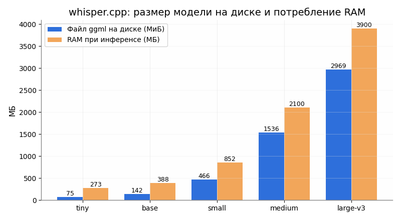
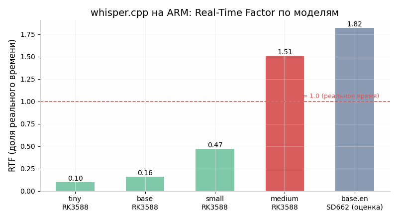
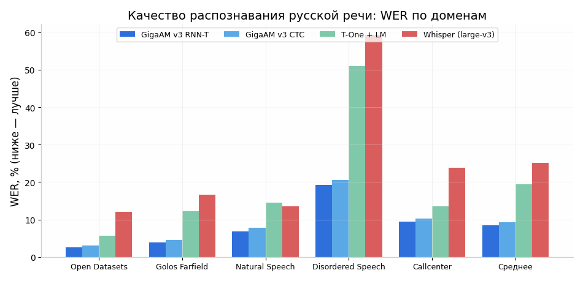

# Офлайн-распознавание речи в DictaPro: whisper.cpp, sherpa-onnx и GigaAM на Flutter Android — что реально работает в 2026 году

**Дата исследования: сентябрь 2026 г.** Объект: Android-диктофон DictaPro (Flutter, Dart 3.5+, полностью офлайн), тестовое устройство vivo V2247, текущий движок — VOSK small (русский). В мае 2026 г. были безуспешные попытки внедрить whisper.cpp через Flutter-пакеты (SIGILL на vivo V2247, проблемы сборки).

---

## Краткий вердикт (TL;DR)

1. **SIGILL был почти гарантирован**: vivo V2247 — это vivo Y36 на Snapdragon 680 (ядра Cortex-A73 + Cortex-A53), у которого **нет инструкций dotprod/i8mm/SVE** ([DeviceInfoHW](http://www.deviceinfohw.ru/devices/item.php?item=109247)). Prebuilt-библиотеки `whisper_flutter_new`, скомпилированные с `-march=armv8.2-a+dotprod` и выше, на таком CPU падают с `Illegal instruction` сразу при первом матричном умножении. Чинится сборкой whisper.cpp **из исходников** под консервативный baseline (или с runtime-диспетчеризацией `GGML_CPU_ALL_VARIANTS=ON`).
2. **Но даже правильно собранный whisper.cpp на этом телефоне медленный**: base на чипе класса Snapdragon 662/680 работает примерно с RTF ~1.8 — **медленнее реального времени** ([VoxRT](https://voxrt.com/asr-comparison)). «Час аудио за 30 минут» на Whisper base/small на vivo V2247 не получится.
3. **Главный вывод исследования — не чинить Whisper, а переходить на sherpa-onnx + GigaAM v3.** В мае 2026 вы отказались от sherpa-onnx как «не имеющего обвязки для Flutter» — это было ошибкой: официальный Flutter-пакет [`sherpa_onnx`](https://pub.dev/packages/sherpa_onnx) существует, поддерживается командой k2-fsa и поставляется с готовыми нативными библиотеками под arm64-v8a. А GigaAM v3 (Сбер, MIT, ноябрь 2025) на русском **в среднем втрое точнее Whisper large-v3** (средний WER 8.4–9.2% против 25.1% ([ai-sage/GigaAM-v3](https://huggingface.co/ai-sage/GigaAM-v3))) и на CPU быстрее Whisper более чем в 20 раз ([Habr](https://habr.com/ru/articles/1042574/)). Версия **e2e выдаёт текст сразу с пунктуацией и нормализацией чисел** — это закрывает ваши баги «восьмидесяти восьми запятая…» безо всякого постпроцессинга.
4. Что **не трогать**: `whisper_flutter_new`, `flutter_whisper_ffi`, `whisper_kit` (оригинал), попытки GPU-ускорения через Vulkan/OpenCL на Adreno 610.

---

## 1. Почему был SIGILL и как это чинится

### 1.1. Диагноз: какой процессор в vivo V2247

Первое, что нужно было сделать ещё в мае, — посмотреть, что за SoC стоит в тестовом устройстве. vivo V2247 — это **vivo Y36**: Snapdragon 680 (SM6225), 8 ядер Kryo 265 (4 × Cortex-A73 @ 2.4 ГГц + 4 × Cortex-A53 @ 1.9 ГГц), GPU Adreno 610, 8 ГБ RAM LPDDR4X, Android 13/14 ([DeviceInfoHW](http://www.deviceinfohw.ru/devices/item.php?item=109247), [Geekbench](https://browser.geekbench.com/v6/cpu/4112164)). Это энергоэффективный чип 2022 года на 6 нм, и его ключевая особенность для нашей темы — микроархитектура ядер.

Cortex-A73 и Cortex-A53 реализуют **ARMv8.0-A с NEON, но без dotprod (SDOT/UDOT), без i8mm и без SVE**. Dotprod появился как опция в ARMv8.2-A и фактически стал стандартом начиная с Cortex-A76/A55; i8mm — с ARMv8.6-A; SVE — это вообще территория ARMv9. Поэтому любой нативный код, скомпилированный с флагами `-march=armv8.2-a+dotprod` или выше, содержит инструкции, которых физически нет в Snapdragon 680. Процессор встречает неизвестный опкод — ядро Linux шлёт процессу сигнал **SIGILL (Illegal instruction)**, и приложение падает мгновенно, без Java-стектрейса.

### 1.2. Механика падения в ggml/whisper.cpp

whisper.cpp построен на тензорной библиотеке ggml, и горячий путь инференса — это векторные скалярные произведения в `ggml_vec_dot_*`, реализованные на SIMD-интринсиках. Именно там и происходит падение: в типичном стектрейсе SIGILL всплывает внутри `ggml_vec_dot_f16` при первом же вызове энкодера ([whisper.cpp issue #12](https://github.com/ggml-org/whisper.cpp/issues/12)). Характерно, что модель при этом **успевает загрузиться** — лог доходит до `whisper_model_load: mem required = …`, а падает уже на вычислении ([whisper.cpp issue #967](https://github.com/ggml-org/whisper.cpp/issues/967)). Это ровно тот симптом, который вы наблюдали: краш «в одном и том же месте» и на base, и на tiny — потому что падает не модель, а вычислительное ядро библиотеки, общее для всех моделей.

Откуда берутся «неправильные» инструкции в пакетах типа `whisper_flutter_new`: автор пакета собирает `.so` один раз на своей машине (или в CI) с настройками по умолчанию. Современные версии ggml по умолчанию на ARM64 Linux/Android либо включают детект возможностей сборочной машины (`GGML_NATIVE=ON`), либо используют baseline armv8.2+dotprod — оба варианта дают бинарник, непереносимый на A73/A53. Пользователь пакета получает готовый `libwhisper.so` внутри AAR/jniLibs и никак не может это переопределить. Ваша ошибка была не в том, что «whisper.cpp не работает на Android», а в том, что **вы запускали чужие бинарники, собранные под более новый CPU**. Тот же эффект объясняет, почему падали и tiny, и base, и почему `flutter_whisper_ffi` «ставилось, но падало».

Второй по частоте источник SIGILL на Android — смешение ABI (armeabi-v7a vs arm64-v8a) и сборка под неверный target, но в вашем случае первична именно несовместимость набора инструкций: vivo V2247 работает в 64-битном режиме, и ABI у вас был правильный.

### 1.3. Правильная сборка: два рабочих подхода

Проблема решается на уровне флагов компиляции ggml — есть два стратегических пути.

**Подход А — консервативный baseline (проще и надёжнее для вашего случая).** Собираем только под arm64-v8a с `GGML_NATIVE=OFF` и без повышения `-march`: компилятор NDK по умолчанию генерирует код под armv8.0+NEON, который исполняется на любом 64-битном ARM-Android, включая A73. Цена — на новых флагманах вы не получите ускорение от dotprod/i8mm (на квантованных q5/q8-моделях это может быть заметные 1.5–2×), зато одна `.so` работает везде.

**Подход Б — runtime-диспетчеризация: `GGML_CPU_ALL_VARIANTS=ON`.** В 2025 году в ggml (через llama.cpp) добавили сборку нескольких CPU-бэкендов одновременно: компилируются варианты `ggml-cpu-armv8.0`, `-armv8.2+dotprod`, `-armv8.6+i8mm`, `-armv9.2+sve/sme` и т.д., а в рантайме библиотека определяет возможности CPU через `getauxval`/`/proc/cpuinfo` и загружает лучший совместимый вариант ([коммит в whisper.cpp](https://huggingface.co/spaces/natasa365/whisper.cpp/commit/c9cec9d2e527e75475d7fd35cfeb94182dfe7bed), [llama.cpp issue #17403](https://github.com/ggml-org/llama.cpp/issues/17403)). Это стандартный способ, которым сегодня собирают релизные бинарники llama.cpp. Поддержка Android для `GGML_CPU_ALL_VARIANTS` также добавлена ([коммит](https://git.petrovv.com/nikola/llama_cpp/commit/3ba0d843c6bd3faea5cf5e53dc7f3c82be20bffb)). Имейте в виду: на старых версиях NDK/компилятора были ошибки сборки с `sme`-фичами ([llama.cpp issue #17403](https://github.com/ggml-org/llama.cpp/issues/17403)) — берите свежий NDK (26.3+/27/28).

Для кросс-компиляции под Android в ggml есть обязательный набор флагов, задокументированный в llama.cpp (whisper.cpp использует ту же систему сборки): `GGML_NATIVE=OFF` (хост ≠ таргет), `GGML_OPENMP=OFF` (не тащить рантайм OpenMP в APK), `GGML_LLAMAFILE=OFF` (этот бэкенд не поддержан на Android) ([llama.cpp docs/build.md](https://github.com/ggml-org/llama.cpp/blob/master/docs/build.md)). Реальный рабочий пример конфигурации Gradle+CMake для whisper.cpp на Android от июля 2026 года выглядит так ([ProAndroidDev](https://proandroiddev.com/from-cloud-llm-to-on-device-whisper-turning-speech-into-structured-actions-on-android-19791f383f4e)):

```kotlin
// app/build.gradle.kts
android {
    ndkVersion = "28.2.13676358"
    defaultConfig {
        ndk { abiFilters += "arm64-v8a" }   // только 64-бит ARM
        externalNativeBuild.cmake {
            arguments += listOf(
                "-DGGML_NATIVE=OFF",
                "-DGGML_OPENMP=OFF",
                "-DGGML_LLAMAFILE=OFF",
                // Вариант А: больше ничего — baseline NEON, работает везде.
                // Вариант Б: "-DGGML_CPU_ALL_VARIANTS=ON", "-DGGML_BACKEND_DL=ON"
            )
            cppFlags += "-std=c++17"
        }
    }
    externalNativeBuild.cmake { path = file("src/main/cpp/CMakeLists.txt") }
    packaging { jniLibs { useLegacyPackaging = true } }
}
```

Эквивалентная чистая CMake-сборка из командной строки (для проверки в Termux или CI):

```bash
cmake -B build-android \
  -DCMAKE_TOOLCHAIN_FILE=$ANDROID_NDK/build/cmake/android.toolchain.cmake \
  -DANDROID_ABI=arm64-v8a \
  -DANDROID_PLATFORM=android-26 \
  -DGGML_NATIVE=OFF -DGGML_OPENMP=OFF -DGGML_LLAMAFILE=OFF \
  -DBUILD_SHARED_LIBS=ON \
  -DCMAKE_BUILD_TYPE=Release
cmake --build build-android -j
# Результат: libwhisper.so + libggml*.so
# (с GGML_CPU_ALL_VARIANTS — ещё несколько libggml-cpu-armv8.*.so)
```

Что получается на выходе и как подключать во Flutter: собирается `libwhisper.so` (C-API из `whisper.h`), плюс библиотеки ggml (`libggml.so`, `libggml-base.so`, `libggml-cpu.so`; при диспетчеризации — набор вариантных `libggml-cpu-*.so`, которые грузятся динамически). Дальше два варианта связки: **(а) dart:ffi напрямую** — кладёте `.so` в `android/src/main/jniLibs/arm64-v8a/` вашего FFI-плагина, в Dart открываете через `DynamicLibrary.open('libwhisper.so')` и дергаете `whisper_init_from_file` / `whisper_full`; **(б) JNI + MethodChannel**, если удобнее держать логику на Kotlin. Важные практические детали из рабочих интеграций: whisper.cpp **не потокобезопасен** — все вызовы должны идти на одном выделенном потоке (в Dart это изолят-рабочий, в Kotlin — `Executors.newSingleThreadExecutor`) ([ProAndroidDev](https://proandroiddev.com/from-cloud-llm-to-on-device-whisper-turning-speech-into-structured-actions-on-android-19791f383f4e)); на вход подаётся **моно PCM float32 16 кГц** (ваши текущие записи через `record` нужно ресемплировать); число потоков ставьте `availableProcessors - 1`, но помните, что на big.LITTLE планировщик всё равно распределит работу между A73 и A53.

**Проверка сборки до интеграции во Flutter**: положите `.so` и `ggml-tiny.bin` на устройство и прогоните `whisper-cli` через `adb shell` (или соберите исполняемый файл в той же CMake-сборке). Если `whisper-cli` отрабатывает jfk.wav — SIGILL побеждён, можно оборачивать. Это дешёвый тест за полчаса, который в мае сэкономил бы вам недели.

---

## 2. Актуальные пути интеграции во Flutter (2025–2026)

Здесь главное открытие исследования относится к вашей строке «sherpa_onnx — нет обвязки для Flutter (тогда так решили)». **Это решение было неверным**: у sherpa-onnx есть официальный, активно поддерживаемый Flutter-пакет.

### 2.1. sherpa_onnx — официальный пакет от k2-fsa

Пакет [`sherpa_onnx`](https://pub.dev/packages/sherpa_onnx) на pub.dev — это полноценная обвязка (Dart API поверх C API через `ffi`), разработанная авторами sherpa-onnx. Архитектура поставки: мета-пакет `sherpa_onnx` зависит от платформенных пакетов `sherpa_onnx_android_arm64`, `sherpa_onnx_android_armeabi`, `sherpa_onnx_android_x86`, `sherpa_onnx_android_x86_64` (и аналогов для iOS/desktop/web), внутри которых лежат готовые нативные библиотеки ([pub.dev](https://pub.dev/packages/sherpa_onnx)). Текущая версия линейки — 1.13.x (платформенные пакеты 1.13.4–1.13.7, осень 2025 – 2026) ([pub.dev](https://pub.dev/packages/sherpa_onnx_android_x86/versions/1.13.4)). Нативные библиотеки построены на **onnxruntime**, который не требует экзотических инструкций и корректно работает на любом arm64 — то есть **проблемы SIGILL здесь в принципе нет**.

Возможности пакета покрывают всё, что нужно диктофону: потоковое и файловое ASR, VAD (Silero), пунктуация, таймстемпы, диаризация, определение языка ([pub.dev](https://pub.dev/packages/sherpa_onnx)). Ключевой момент для вас: **Dart API идентичен C++ API**, поэтому любая модель, которую умеет грузить sherpa-onnx (в т.ч. русские GigaAM и потоковые zipformer/T-One), доступна из Flutter без единой строчки нативного кода. Пример инициализации файлового распознавателя на русском трансдьюсере:

```dart
import 'package:sherpa_onnx/sherpa_onnx.dart' as sherpa;

final config = sherpa.OfflineRecognizerConfig(
  model: sherpa.OfflineModelConfig(
    transducer: sherpa.OfflineTransducerModelConfig(
      encoder: '$dir/encoder.int8.onnx',
      decoder: '$dir/decoder.onnx',
      joiner:  '$dir/joiner.onnx',
    ),
    tokens: '$dir/tokens.txt',
    modelType: 'nemo_transducer',   // для GigaAM
    numThreads: 4,
    debug: false,
  ),
);
final recognizer = sherpa.OfflineRecognizer(config);
final stream = recognizer.createStream();
stream.acceptWaveform(sampleRate: 16000, samples: pcmFloat32);
recognizer.decode(stream);
final text = recognizer.getResult(stream).text;
```

Отдельно у проекта есть каталог `flutter-examples` (streaming_asr, non_streaming_asr и др.) и **готовые собранные APK под arm64-v8a для десятков комбинаций моделей**, включая «VAD + non-streaming ASR» ([sherpa docs](https://k2-fsa.github.io/sherpa/onnx/flutter/pre-built-app.html)). Это значит, что прототип можно даже не писать: скачать APK, поставить на vivo V2247 и проверить качество/скорость русской модели за один вечер.

### 2.2. whisper_ggml — жив, переписан, и проблему с NDK можно обойти

Пакет [`whisper_ggml`](https://pub.dev/packages/whisper_ggml) (ваш майский фейл «требует NDK 26, не собралось») с тех пор активно развивался: актуальная версия **2.5.0 (август 2026)**, внутри — whisper.cpp **v1.9.1**, заявлено ускорение движка примерно в 15 раз относительно версий до 2.0.0, поддержка Android и iOS, офлайн-модели из assets, `transcribeLive` с потоковыми частичными результатами ([pub.dev](https://pub.dev/packages/whisper_ggml/versions/2.5.0)). Пакет собирает whisper.cpp **из vendored-исходников** через CMake при сборке приложения — поэтому SIGILL от чужого prebuilt ему не грозит, а требование свежего NDK решается одной строкой `ndkVersion = "26.3.11579264"` (или новее) в `build.gradle` приложения. На Snapdragon 680, впрочем, остаётся проблема скорости, а не сборки — см. раздел 3.

### 2.3. Прочие пакеты: что живое, что мёртвое

| Пакет / подход | Статус (сентябрь 2026) | Вердикт |
|---|---|---|
| [`whisper_cpp_flutter_plus`](https://github.com/47gurvinder/whisper_cpp_flutter) | Активный (июль 2026): vendored whisper.cpp **v1.9.2**, сборка из исходников, Android API 24+, live-транскрипция, Silero VAD, экспорт SRT/VTT/JSON, встроенный бенчмарк на физическом устройстве | Лучший «whisper.cpp из коробки» на сегодня |
| [`whisper_ggml`](https://pub.dev/packages/whisper_ggml/versions/2.5.0) | Активный, 2.5.0, whisper.cpp v1.9.1 | Рабочий; нужен NDK ≥ 26.3 |
| [`whisper_ggml_plus`](https://pub.dev/packages/whisper_ggml_plus) | whisper.cpp v1.8.3, файловая транскрипция, VAD, поддержка large-v3-turbo | Живой, но менее развит |
| `whisper_flutter_new` | Заброшен; prebuilt `.so` со слишком новым baseline — **источник вашего SIGILL** | Не трогать |
| `flutter_whisper_ffi` | Заброшен, падения | Не трогать |
| `whisper_kit` (оригинал) | Нет Android-сборки; существуют форки вроде [CodeSagePath/whisper_kit](https://github.com/CodeSagePath/whisper_kit) с C/C++-мостом под Android, но активность низкая | Только как референс |
| [`azkadev/whisper_flutter`](https://medium.com/@azkadev/i-made-whisper-library-for-dart-and-flutter-offline-without-api-key-without-ffmpeg-d13aa040c21b) | Авторский пакет, заявлена работа «даже на слабом Android» | Нишевый, проверять на себе |
| Собственный FFI-плагин (dart:ffi + своя сборка `.so`) | Всегда актуален; полный контроль над флагами | Запасной вариант с максимальным контролем |

Методология выбора простая: любой пакет, который **тащит чужой prebuilt `.so`**, на парке разнообразных устройств рискует повторить ваш SIGILL; пакеты, которые **собирают whisper.cpp из исходников в момент сборки приложения** (whisper_ggml 2.x, whisper_cpp_flutter_plus), этой болезни лишены по построению. sherpa_onnx стоит особняком: его нативная часть — это onnxruntime, который сам по себе переносим, поэтому prebuilt там безопасен.

---

## 3. Модели для телефона: размеры, RAM, скорость, качество русского

### 3.1. Whisper: физика размеров и памяти

Официальные цифры whisper.cpp по потреблению ресурсов ([whisper.cpp README](https://github.com/ggml-org/whisper.cpp)):

| Модель | Файл на диске | RAM при инференсе | Квантованные варианты (диск) |
|---|---|---|---|
| tiny | 75 МиБ | ~273 МБ | tiny-q5_1 ~ 32 МиБ |
| base | 142 МиБ | ~388 МБ | base-q5_1 57 МиБ, base-q8_0 78 МиБ |
| small | 466 МиБ | ~852 МБ | small-q5_1 181 МиБ, small-q8_0 252 МиБ |
| medium | 1.5 ГиБ | ~2.1 ГБ | medium-q5_0 514 МиБ, medium-q8_0 785 МиБ |
| large-v3 | 2.9 ГиБ | ~3.9 ГБ | — |
| large-v3-turbo | 1.6 ГиБ | ~2.3 ГБ | — |

Размеры квантованных файлов — из репозитория [ggerganov/whisper.cpp](https://huggingface.co/ggerganov/whisper.cpp) на Hugging Face; средние WER по языкам и скорости относительно large — из обзора [OpenWhispr](https://openwhispr.com/blog/whisper-model-sizes-explained).



Для вашего устройства (8 ГБ RAM) ограничение по памяти не является блокером вплоть до small и даже medium: small в q5_1 занимает ~180 МБ на диске и порядка 400–500 МБ в RAM. **Блокер — процессорная скорость**, а не память.

### 3.2. Скорость whisper.cpp на ARM: что реально ожидать на Snapdragon 680

Публичных бенчмарков whisper.cpp именно на Snapdragon 680 почти нет — сам whisper.cpp публикует только Apple Silicon-замеры, а в сообществе принято оценивать мобильный RTF косвенно ([VoxRT](https://voxrt.com/asr-comparison)). Соберём картину из измеренных точек. На RK3588 (4×Cortex-A76 + 4×A55 — заметно сильнее SD680) с 8 потоками измерено: tiny RTF 0.10, base 0.16, small 0.47, medium 1.51 ([Turing Pi](https://turingpi.com/whisper-cpp-piper-tts-arm64-turing-pi-rk3588/)). На Snapdragon 662 (те же Cortex-A73-класс ядра, что и SD680, чуть ниже частоты) для base.en даётся оценка **RTF ~1.82 — медленнее реального времени** ([VoxRT](https://voxrt.com/asr-comparison)); независимые обзоры сходятся в том, что base.en на средних Android-чипах 2020–2022 годов показывает RTF в диапазоне 0.4–0.7 только в лучших случаях и «заметно греет устройство» при длительной работе ([dev.to](https://dev.to/voxrtio/streaming-asr-vs-whisper-on-mobile-when-to-switch-5cm7)).



Экстраполяция на vivo V2247 (SD680, на одну ступень выше SD662): **tiny — примерно RTF 0.5–0.9, base — 1.2–1.8, small — 4–7** (оценка, требует проверки на устройстве). Вывод по вашему вопросу «реалистична ли фоновая пост-обработка час за ~30 мин» (это RTF 0.5): на Whisper — **нет**, если только не ограничиться tiny, качество русского у которого вас не устроит. На флагманах (Snapdragon 8-й серии) base/small идут быстрее реального времени, но ваше целевое устройство — не флагман, и медленные устройства в пользовательской базе будут нормой.

### 3.3. Качество русского у Whisper

По русскому Whisper — «переменный второй эшелон»: у large-v3 типичный реальный WER 8–14% ([Vexascribe](https://vexascribe.com/how-accurate-is-whisper)). Мультиязычные tiny/base на русском заметно слабее large: ориентировочные мультиязычные WER — tiny ~12%, base ~10%, small ~7% ([OpenWhispr](https://openwhispr.com/blog/whisper-model-sizes-explained)), причём это усреднение по языкам, на русском малые модели ошибаются сильнее среднего. Для сравнения: файнтюн whisper-small под русский на Common Voice показывает WER ~12.2% ([lorenzoncina/whisper-small-ru](https://huggingface.co/lorenzoncina/whisper-small-ru)). Важно и то, что проблему «числа словами» Whisper решает частично (у него есть встроенная нормализация в стиле письменного текста), но термины и аббревиатуры на малых моделях страдают. В свежем независимом продакшен-сравнении на реальных русских записях Whisper large-v3-turbo и GigaAM v3 шли вровень на чистой речи, а **на шумной и реверберированной записи Whisper выигрывал** ([Habr](https://habr.com/ru/articles/1042574/)) — но large-v3-turbo на телефоне непрактичен по скорости (на десктопном CPU его RTF ~1.02 против 0.047 у GigaAM ([Habr](https://habr.com/ru/articles/1042574/))).

### 3.4. GigaAM v3 и русские модели в экосистеме sherpa-onnx

Здесь ситуация за 2025–2026 годы изменилась кардинально, и именно это делает пересмотр вашего майского решения осмысленным.

**GigaAM v3** (Salute AI / Сбер, релиз ноябрь 2025, лицензия MIT): Conformer-энкодер 220–240M параметров, предобучение на 700 тыс. часов русской речи, четыре варианта — `ctc`, `rnnt`, `e2e_ctc`, `e2e_rnnt`; **e2e-варианты выдают текст сразу с пунктуацией и нормализацией** (числа цифрами, «₽», капитализация) ([ai-sage/GigaAM-v3](https://huggingface.co/ai-sage/GigaAM-v3), [Habr Сбера](https://habr.com/ru/companies/sberdevices/articles/973160/)). По официальным замерам средний WER по разнородным русским доменам: **RNN-T 8.4% / CTC 9.2% против 25.1% у Whisper (large)**; в side-by-side с LLM-судьёй e2e-модели выигрывают у Whisper-large-v3 со счётом **70:30** ([ai-sage/GigaAM-v3](https://huggingface.co/ai-sage/GigaAM-v3)). Отдельно ценно для вас: в обучение v3 добавлены домены «колл-центр, музыка, голосовые сообщения, спонтанная и нестандартная речь» — то есть ровно диктофонные сценарии ([Сбер](https://www.sberbank.ru/ru/sberpress/tekhnologii/article?newsID=e20a1233-c1e7-42b1-92a9-ae71b0d2a0d6&blockID=69b149cd-6db4-45aa-ade1-b6920d771b11&regionID=77&lang=ru&type=NEWS)).



Справедливости ради — независимая проверка (июнь 2026) показывает более трезвую картину: на чистой студийной речи GigaAM v3-e2e-rnnt и Whisper turbo идут вровень (7.89% vs 7.28% WER на подкастах), на тяжёлом шуме/реверберации Whisper устойчивее, зато GigaAM на CPU **быстрее более чем в 20 раз** и потому — «единственный реалистичный вариант для CPU-сборок» ([Habr](https://habr.com/ru/articles/1042574/)). Для диктофона (близкий микрофон, относительно чистая речь) это идеальный профиль.

**Доступность GigaAM в sherpa-onnx** — ключевой вопрос интеграции. Состояние на сентябрь 2026:

| Модель | Где лежит | Размер | Статус |
|---|---|---|---|
| GigaAM v2 RNN-T (sherpa-конверсия) | [sherpa-onnx-nemo-transducer-giga-am-v2-russian-2025-04-19](https://k2-fsa.github.io/sherpa/onnx/pretrained_models/offline-transducer/nemo-transducer-models.html) | encoder.int8 226 МБ + decoder 3.2 МБ + joiner 1.4 МБ | Официально документирована, работает в sherpa-onnx и в Flutter-пакете |
| GigaAM v2 CTC | [sherpa-onnx-nemo-ctc-giga-am-v2-russian](https://k2-fsa.github.io/sherpa/onnx/pretrained_models/offline-ctc/nemo/russian.html) | model.int8.onnx (один файл) | Официально документирована |
| **GigaAM v3 RNN-T** | [csukuangfj/sherpa-onnx-nemo-transducer-giga-am-v3-russian-2025-12-16](https://huggingface.co/csukuangfj/sherpa-onnx-nemo-transducer-giga-am-v3-russian-2025-12-16) | encoder.int8.onnx **225 МБ** + decoder + joiner | Сконвертирована автором sherpa-onnx; в официальные релизы/APK пока не включена, но пользователи подтверждают работу через onnxruntime ([issue #3619](https://github.com/k2-fsa/sherpa-onnx/issues/3619)); через Dart API `modelType: 'nemo_transducer'` грузится с диска |
| **GigaAM v3 RNN-T с пунктуацией (e2e)** | [csukuangfj/sherpa-onnx-nemo-transducer-punct-giga-am-v3-russian-2025-12-16](https://huggingface.co/csukuangfj/sherpa-onnx-nemo-transducer-punct-giga-am-v3-russian-2025-12-16) | encoder.int8.onnx 225 МБ | То же; даёт пунктуацию из коробки |
| Потоковый русский zipformer | [sherpa-onnx-streaming-zipformer-ru / small-zipformer-ru-2024-09-18](https://k2-fsa.github.io/sherpa/onnx/pretrained_models/offline-transducer/zipformer-transducer-models.html) | десятки МБ (int8) | Официальная, стриминг с VAD |
| **T-One (Т-Банк), потоковый русский CTC** | [t-tech/T-one](https://huggingface.co/t-tech/T-one) → [sherpa-onnx-streaming-t-one-russian-2025-09-08](https://huggingface.co/csukuangfj/sherpa-onnx-streaming-t-one-russian-2025-09-08) | 71M параметров | Добавлен в sherpa-onnx в сентябре 2025 ([issue #2567](https://github.com/k2-fsa/sherpa-onnx/issues/2567)); лучший WER на телефонии среди открытых потоковых моделей |

По скорости: GigaAM v3 через onnx-asr на серверном CPU показывает RTF ~0.047 (минута аудио за ~3 секунды) ([Habr](https://habr.com/ru/articles/1042574/)); на десктопном i7-7700HQ для GigaAM v2 измерены RTFx 10–12 (то есть RTF ~0.09) ([onnx-asr](https://pypi.org/project/onnx-asr/)). На Snapdragon 680 реалистично ожидать RTF порядка **0.2–0.5** для int8-энкодера — то есть **час аудио за 12–30 минут в фоне**, что попадает в вашу цель «час за ~30 минут» уже на нижней границе оценки. Это прогноз, его обязательно нужно проверить на устройстве (раздел 7), но в отличие от Whisper тут цель достижима физически: Conformer-RNN-T архитектурно легче авторегрессионного декодера Whisper на длинном аудио.

По памяти: набор GigaAM v3 int8 (≈230 МБ файлы) потребует порядка 300–500 МБ RAM при инференсе — комфортно для 8 ГБ устройства и приемлемо даже для 4 ГБ. Размер загрузки ~230 МБ больше ваших нынешних 45 МБ VOSK small, но на порядок меньше VOSK large (1.8 ГБ) и сопоставим с играми средней тяжести; учитывая разницу в качестве, это разумная цена, которую можно сгладить фоновой загрузкой по Wi-Fi.

---

## 4. Архитектура: поток vs файл, VAD, батарея

**Потоковая vs пофайловая обработка.** Для диктофона правильная схема — **не гнаться за истинным стримингом текста во время записи**, а распознавать после остановки записи (или фоновыми порциями). Причина чисто физическая: на SD680 даже лёгкие модели близки к RTF 0.2–1.0, и параллельная работа ASR во время записи означает постоянную нагрузку на все ядра, нагрев и риск пропусков аудио. Практика сообщества прямо предупреждает: always-on Whisper на средних Android «заметно нагревает устройство и ест батарею», устойчивый непрерывный режим требует RTF < 0.4 ([dev.to](https://dev.to/voxrtio/streaming-asr-vs-whisper-on-mobile-when-to-switch-5cm7)). Компромисс, который используют зрелые приложения: **двухпроходная схема** — во время записи быстрый потоковый черновик (streaming zipformer-ru или T-One через sherpa-onnx), после остановки — точный второй проход GigaAM v3 по файлу. sherpa-onnx поддерживает two-pass ASR официально, вплоть до готовых APK с этой схемой ([HF Forums, csukuangfj](https://discuss.huggingface.co/t/using-a-fine-tuned-whisper-sherpa-onnx-model-to-create-a-android-app-with-flutter/134467)).

**Нарезка длинных файлов.** Модели класса GigaAM/Whisper штатно принимают фрагменты ~20–30 секунд (для ONNX-экспортов действует ограничение 20–30 с, длинное аудио подаётся через VAD ([onnx-asr](https://pypi.org/project/onnx-asr/))). При этом независимые замеры показывают, что наивная нарезка на чанки стоит **~6 п.п. WER** на стыках — правильный подход: резать по паузам через **Silero VAD** (есть в sherpa_onnx как `Vad`), а для пакетной обработки файла подавать максимально длинные непрерывные куски ([Habr](https://habr.com/ru/articles/1042574/)). Внутренний VAD Whisper, кстати, в том же сравнении проиграл внешнему Silero на 3–4 п.п. — ещё один аргумент за единый VAD-слой независимо от движка.

**Батарея и тепло.** Час фоновой обработки — это десятки минут работы 4–6 ядер на полной частоте. Рекомендации: выполнять пост-обработку как отложенную фоновую задачу (WorkManager/изолят), желательно с опцией «только на зарядке / только Wi-Fi для загрузки моделей», число потоков ограничить 4 и по возможности планировать на big-кластер; показывать прогресс и ETA из RTF, измеренного на конкретном устройстве. RAM-бюджет: GigaAM v3 int8 ~300–500 МБ, whisper small ~850 МБ, tiny ~270 МБ ([whisper.cpp README](https://github.com/ggml-org/whisper.cpp)) — при 8 ГБ всё это безопасно, при 3–4 ГБ (слабые устройства пользователей) предпочтителен int8-набор GigaAM или whisper tiny/base.

**Офлайн-чистота.** Оба пути (sherpa-onnx и whisper.cpp) полностью локальны: модели скачиваются один раз (или поставляются в assets), дальше сеть не нужна — это соответствует вашему позиционированию. ONNX Runtime Mobile и sherpa-onnx работают без каких-либо сетевых вызовов ([ONNX Runtime on Android](https://medium.com/softaai-blogs/onnx-runtime-on-android-the-ultimate-guide-to-lightning-fast-ai-inference-097123814ee3)).

---

## 5. Готовые примеры, которые можно повторить

| Проект | Что внутри | Ссылка |
|---|---|---|
| sherpa-onnx `flutter-examples` | Официальные примеры k2-fsa: streaming_asr, non_streaming_asr (VAD+ASR), TTS и др.; из них же собираются готовые APK под arm64-v8a | [github.com/k2-fsa/sherpa-onnx](https://github.com/k2-fsa/sherpa-onnx), [доки](https://k2-fsa.github.io/sherpa/onnx/flutter/pre-built-app.html) |
| Готовые Flutter APK от k2-fsa | «VAD + non-streaming ASR» под десяток моделей (в т.ч. whisper, parakeet, zipformer) — ставятся на устройство без сборки | [sherpa_onnx_linux example](https://pub.dev/packages/sherpa_onnx_linux/example) |
| Voice Control in Flutter (Medium, сент 2025) | Пошаговая статья: sherpa_onnx ^1.12.11 + record + permission_handler, zipformer-модель, Makefile для скачивания модели; замеры Sherpa-ONNX vs Whisper vs Vosk | [Medium](https://medium.com/@khlebobul/voice-control-in-flutter-how-to-add-local-speech-recognition-to-your-app-4bcd96bfd896) |
| whisper.cpp `examples/whisper.android` | Официальное Kotlin-приложение whisper.cpp; рабочая проверка: tiny.en на Android-устройстве транскрибирует 11-секундный сэмпл за ~4.3 с | [README](https://huggingface.co/spaces/natasa365/whisper.cpp/blob/6dbbbab767d4ac2c4f4cf9d042286a3eddc08997/examples/whisper.android/README.md), [заметки](https://atomglitch.com/whisper-android-example/) |
| whisper_cpp_flutter_plus | Полноценный Flutter-плагин (whisper.cpp v1.9.2 из исходников) с example-приложением и воспроизводимым бенчмарком на физическом устройстве | [GitHub](https://github.com/47gurvinder/whisper_cpp_flutter) |
| On-Device Whisper + JNI (ProAndroidDev, июль 2026) | Свежая статья с рабочим Gradle/CMake-конфигом whisper.cpp под Android (NDK 28, GGML_OPENMP=OFF и т.д.) | [ProAndroidDev](https://proandroiddev.com/from-cloud-llm-to-on-device-whisper-turning-speech-into-structured-actions-on-android-19791f383f4e) |
| iaa2005/GigaAM-v3-punct (сборка под приложение) | Репозиторий, где кто-то уже собрал e2e-вариант GigaAM v3 (с пунктуацией) для скачивания из мобильного приложения — «STT, the default — Russian transducer with punctuation» | [Hugging Face](https://huggingface.co/iaa2005/sherpa-onnx-nemo-transducer-punct-giga-am-v3-russian-2025-12-16) |

Для вас критичны первые две строки: можно проверить GigaAM на живом vivo V2247 **вообще без написания кода** — поставить официальный APK и/или собрать flutter-example, подложив файлы модели GigaAM v3.

---

## 6. Сводная таблица вариантов

| Подход | Сложность | Шанс успеха | Качество русского | RAM / скорость на SD680 | Что нужно |
|---|---|---|---|---|---|
| **sherpa_onnx + GigaAM v3 e2e (rnnt, int8)** — рекомендуется | Низкая: пакет + загрузка 4 файлов модели | **Высокий** (Dart API официальный, модель сконвертирована автором sherpa-onnx) | **Лучшее среди офлайн** (средний WER ~8.4%, пунктуация+числа из коробки ([ai-sage/GigaAM-v3](https://huggingface.co/ai-sage/GigaAM-v3))) | ~230 МБ файлы, 300–500 МБ RAM; прогноз RTF 0.2–0.5 → час аудио за ~15–30 мин | `sherpa_onnx: ^1.13.x`, файлы модели с HF, `modelType: 'nemo_transducer'` |
| sherpa_onnx + GigaAM **v2** (rnnt/ctc, int8) | Низкая | Очень высокий (официально документировано) | Очень хорошее (v2 лидировала до v3) | То же | То же, модель из официального списка |
| sherpa_onnx + потоковый zipformer-ru / T-One | Низкая | Очень высокий | Среднее-хорошее; T-One силён на телефонии ([t-tech/T-one](https://huggingface.co/t-tech/T-one)) | Десятки МБ, real-time даже на слабом CPU | Для живого черновика во время записи |
| whisper_ggml 2.5.0 (whisper.cpp v1.9.1, сборка из исходников) | Низкая-средняя | Средний: SIGILL не будет, но скорость низкая | tiny/base на русском слабые; small приличный, но медленный | base ~390 МБ RAM, RTF ~1.2–1.8; small — в разы хуже | NDK ≥ 26.3 в build.gradle, модель ggml |
| whisper_cpp_flutter_plus (v1.9.2) | Низкая-средняя | Средний (та же скорость) | То же | То же; есть VAD и live-режим | Пакет + модель |
| Свой FFI-плагин: своя сборка whisper.cpp (baseline NEON или ALL_VARIANTS) | **Высокая** (C/CMake/JNI) | Средний | То же | То же | Рецепт раздела 1.3 |
| Whisper через GPU (Vulkan/OpenCL, Adreno 610) | Очень высокая | Низкий: Vulkan-бэкенд whisper.cpp молод, на Android/Adreno — известные проблемы с ICD и пайплайнами ([issue #2370](https://github.com/ggml-org/whisper.cpp/issues/2370), [Shotcut forum](https://forum.shotcut.org/t/support-gpu-accelerated-whisper-on-more-platforms/51218)) | — | Adreno 610 слабый, выигрыш сомнителен | Не рекомендуется |
| Оставить VOSK small | — | — | Низкое (ваши баги с числами/терминами) | Отличные | Текущее состояние |
| VOSK large (1.8 ГБ) | Низкая | Высокий, но неприемлемый размер загрузки | Среднее | 1.8 ГБ скачивание | Отклонено вами же |

---

## 7. Рекомендация и план действий

**Пробовать первым — sherpa_onnx + GigaAM v3.** Это единственный вариант, который одновременно: (а) не требует нативной разработки, (б) не имеет класса проблемы SIGILL, (в) даёт лучшее доступное офлайн-качество русского, (г) с запасом закрывает требование по скорости фоновой обработки, (д) из коробки выдаёт пунктуацию и числа цифрами — ваши два главных UX-бага исчезают без постпроцессинга.

**Этапы (с критериями «получится/нет»):**

1. **День 1 — проверка без кода.** Поставить на vivo V2247 официальный APK sherpa-onnx «VAD + non-streaming ASR» и/или собрать `flutter-examples` без изменений с моделью GigaAM v2 (она в официальном списке). *Критерий: приложение работает, русская речь распознаётся заметно лучше VOSK.*
2. **Дни 2–3 — GigaAM v3 в своём прототипе.** Минимальное Flutter-приложение: `sherpa_onnx: ^1.13.x`, скачивание набора `sherpa-onnx-nemo-transducer-punct-giga-am-v3-russian-2025-12-16` (encoder.int8.onnx 225 МБ + decoder + joiner + tokens) во внутреннее хранилище, конфиг `OfflineRecognizerConfig(modelType: 'nemo_transducer')`, прогон 5–10 ваших эталонных записей (включая те, где VOSK писал «же Конца» и числа словами). *Критерии: нет падений; субъективно лучше VOSK; измеренный RTF ≤ 0.6 (час ≤ 36 мин); пик RAM ≤ 600 МБ.* Если v3-набор вдруг не заведётся через текущую версию пакета — немедленный fallback на официально поддержанную GigaAM v2 (`nemo_transducer` / `nemo_ctc`), которая документирована и тоже сильно лучше VOSK.
3. **Неделя 2 — интеграция в DictaPro.** Фоновая очередь постобработки (изолят + WorkManager), Silero VAD для нарезки по паузам, прогресс-бар из измеренного RTF, опция «только на зарядке», выбор модели «быстрая (v3 int8) / компактная (zipformer-ru)» в настройках. *Критерий выхода: час записи обрабатывается ≤ 30–40 минут, приложение не греется до троттлинга, качество устраивает на вашем корпусе.*

**Запасной вариант** — вернуться к whisper.cpp «правильно»: либо `whisper_ggml` 2.5.0 с прописанным `ndkVersion`, либо `whisper_cpp_flutter_plus`, либо свой FFI со сборкой по рецепту 1.3 (baseline NEON или `GGML_CPU_ALL_VARIANTS=ON`). Это устранит краши, но по скорости на SD680 вы получите в лучшем случае RTF ~0.6–0.9 на tiny и >1 на base — то есть «час за 30 минут» недостижим, а качество русского на tiny/base будет ниже, чем у GigaAM. Использовать этот путь есть смысл только если GigaAM по какой-то причине не взлетит, или как «премиум-режим» для флагманов пользователей (small q5_1).

**Не трогать:** `whisper_flutter_new` и `flutter_whisper_ffi` (заброшены, источник SIGILL), оригинальный `whisper_kit` (нет Android), GPU-ускорение whisper.cpp на Adreno (сыро и бессмысленно на 610-м), VOSK large (1.8 ГБ никто качать не будет — вы правы).

---

## 8. Конкретные команды для первого шага (минимальный прототип)

```bash
# 1. Новый прототип
flutter create giga_probe && cd giga_probe

# 2. Зависимости
flutter pub add sherpa_onnx record path_provider permission_handler

# 3. Модель GigaAM v3 (int8, с пунктуацией) — скачать на десктоп и положить
#    в assets или скачивать из приложения во внутреннее хранилище:
#    https://huggingface.co/csukuangfj/sherpa-onnx-nemo-transducer-punct-giga-am-v3-russian-2025-12-16
#    Файлы: encoder.int8.onnx (225 МБ), decoder.onnx, joiner.onnx, tokens.txt
#    Резерв: официальная v2:
#    https://github.com/k2-fsa/sherpa-onnx/releases (asr-models, giga-am-v2)

# 4. Запуск на устройстве (release — важно: в debug нативная скорость непоказательна)
flutter run --release -d <vivo_V2247>
```

Минимальный Dart-код распознавания файла:

```dart
import 'package:sherpa_onnx/sherpa_onnx.dart' as sherpa;

Future<String> transcribe(String modelDir, Float32List pcm16k) async {
  sherpa.initBindings();
  final recognizer = sherpa.OfflineRecognizer(sherpa.OfflineRecognizerConfig(
    model: sherpa.OfflineModelConfig(
      transducer: sherpa.OfflineTransducerModelConfig(
        encoder: '$modelDir/encoder.int8.onnx',
        decoder: '$modelDir/decoder.onnx',
        joiner: '$modelDir/joiner.onnx',
      ),
      tokens: '$modelDir/tokens.txt',
      modelType: 'nemo_transducer',
      numThreads: 4,
      provider: 'cpu',
    ),
  ));
  final stream = recognizer.createStream();
  stream.acceptWaveform(sampleRate: 16000, samples: pcm16k);
  recognizer.decode(stream);
  final text = recognizer.getResult(stream).text;
  stream.free(); recognizer.free();
  return text; // ожидается текст с пунктуацией и цифрами: «88,64 %», «ЖКТ»
}
```

Если параллельно хочется всё-таки опровергнуть/подтвердить whisper.cpp-ветку: соберите `whisper-cli` по командам из раздела 1.3 (baseline NEON), скопируйте бинарник и `ggml-base.bin` на устройство через `adb push` и замерьте `time ./whisper-cli -m ggml-base.bin -l ru -f test.wav` — 15 минут работы, и у вас будут честные RTF вашего железа для финального решения.

---

## 9. Честная оценка: стоит ли вообще

**Да, стоит — но не через Whisper.** Ваш майский провал был вызван не тупиковостью идеи «лучший офлайн-ASR на Flutter Android», а двумя конкретными ошибками отбора: prebuilt-бинарники whisper.cpp на устройстве без dotprod и неверный отказ от sherpa-onnx из-за предположения об отсутствии Flutter-обвязки. За прошедшие месяцы экосистема сдвинулась в вашу сторону: вышла GigaAM v3 с MIT-лицензией и e2e-нормализацией (ноябрь 2025 ([Сбер](https://www.sberbank.ru/ru/sberpress/tekhnologii/article?newsID=e20a1233-c1e7-42b1-92a9-ae71b0d2a0d6&blockID=69b149cd-6db4-45aa-ade1-b6920d771b11&regionID=77&lang=ru&type=NEWS))), автор sherpa-onnx официально сконвертировал её под свой рантайм (декабрь 2025 ([Hugging Face](https://huggingface.co/csukuangfj/sherpa-onnx-nemo-transducer-giga-am-v3-russian-2025-12-16))), а Flutter-пакет дорос до 1.13.x со стабильными платформенными сборками. По сути, задача «качественный русский офлайн-ASR в Flutter-приложении» на сентябрь 2026 имеет готовое решение, требующее интеграции, а не исследований.

При этом трезвость обязательна в трёх местах. Во-первых, **скорость GigaAM на SD680 — прогноз, а не факт**: все публичные замеры сделаны на десктопных CPU или серверах; вероятный диапазон RTF 0.2–0.5 достижим, но подтвердить его может только запуск на вашем vivo (этап 2 плана). Во-вторых, **на сильном шуме и реверберации Whisper устойчивее GigaAM** ([Habr](https://habr.com/ru/articles/1042574/)) — для диктофона с близким микрофоном это некритично, но если ваши пользователи пишут лекции с задних рядов, держите в голове «премиум»-режим whisper small для флагманов или облачный режим как крайний вариант. В-третьих, размер загрузки вырастет с 45 МБ до ~230 МБ — компенсируйте это фоновой докачкой по Wi-Fi и понятным объяснением пользователю, за что он платит трафиком (точность, пунктуация, цифры).

Наконец, про баланс с облачным режимом, который у вас уже есть: офлайн-гигантская модель и облако не конкуренты, а слои одного продукта. GigaAM v3 закрывает 95% сценариев локально и бесплатно; облако остаётся осознанным выбором пользователя для тяжёлых записей. Такая конфигурация снимает главный стратегический риск вашего позиционирования «данные не покидают устройство» — вы перестаёте жертвовать качеством ради офлайна.

---

*Исследование носит информационный характер; прогнозы производительности для Snapdragon 680 являются экстраполяцией опубликованных измерений и требуют проверки на целевом устройстве.*
