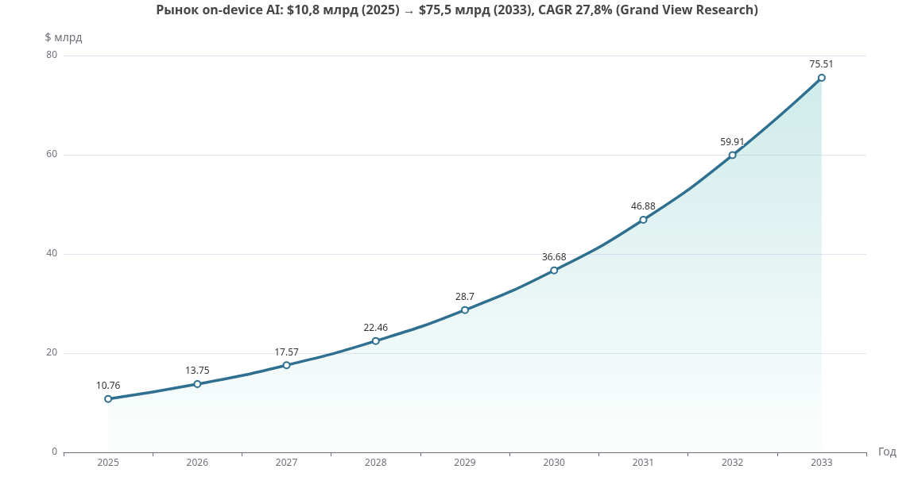
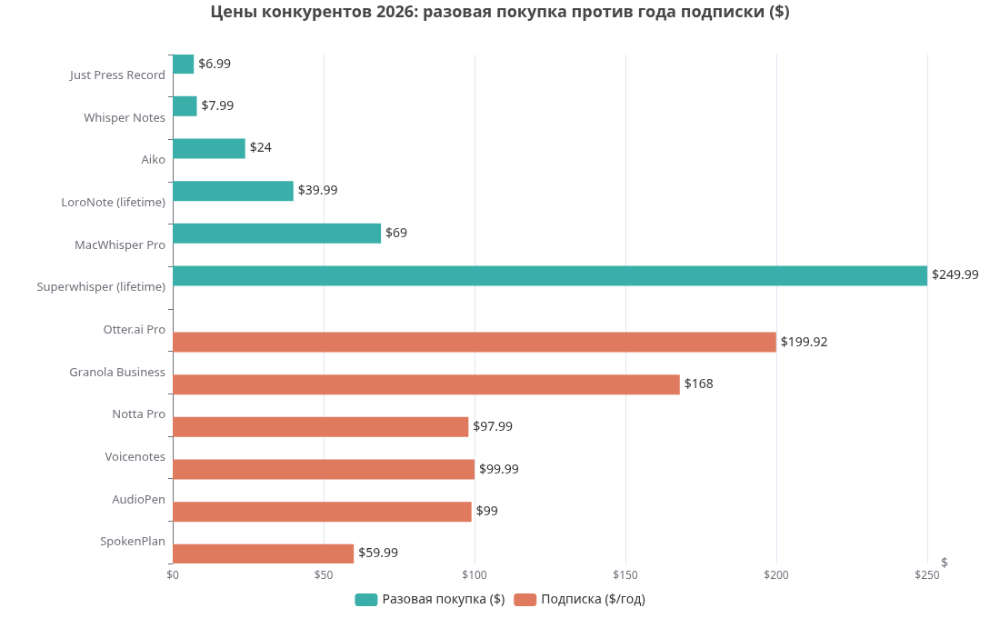
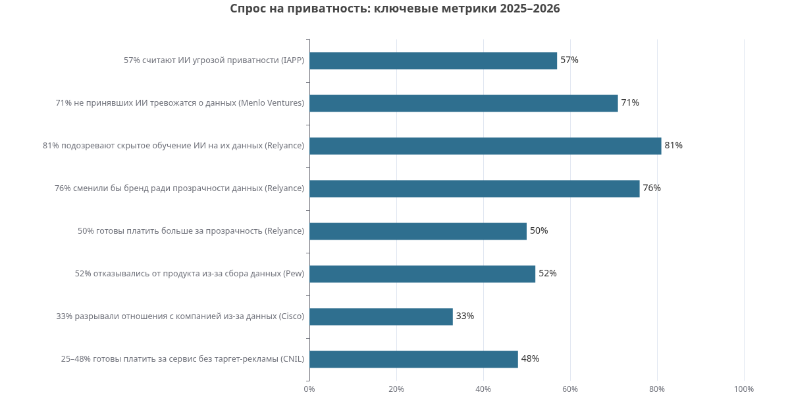
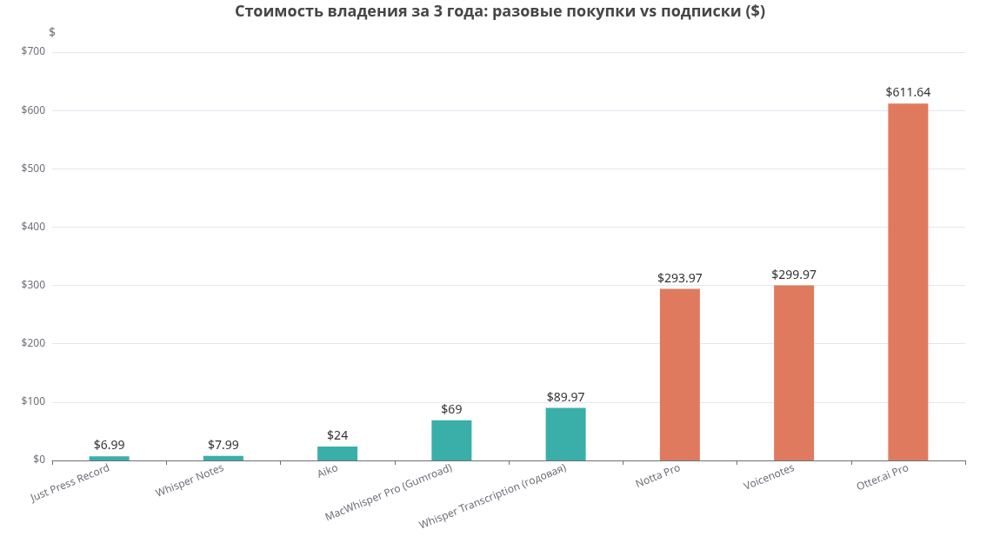

# Мировой рынок офлайн-диктофонов и privacy-first заметок в 2026 году

## Глубокое исследование для DictaPro: конкуренты, цены, спрос на приватность, продвижение, риски

**Дата исследования: сентябрь 2026 года.** Отчёт подготовлен по брифу проекта DictaPro (офлайн-диктофон на Android/Flutter с расшифровкой на устройстве, локальным саммари и разовой покупкой; запуск — РФ, затем глобальные рынки EN/DE/ES).

---

## Резюме для принятия решений (TL;DR)

**Вывод исследования: окно возможности для DictaPro реально и подтверждено данными, но оно сужается со стороны платформ — действовать нужно в ближайшие 12–18 месяцев.** Категория «запись + транскрипция + саммари» в 2026 году переживает взрывной рост: рынок приложений-диктофонов оценивается в **$10,05 млрд в 2025 году** с прогнозируемым CAGR 12,59% ([Skywork](https://skywork.ai/skypage/en/ai-voice-recorder-android-apps/2034894979327086592)), а рынок on-device AI в целом вырастет с **$10,8 млрд (2025) до $75,5 млрд к 2033 году** при CAGR 27,8% ([Grand View Research](https://www.grandviewresearch.com/industry-analysis/on-device-ai-market-report)). При этом облачные лидеры категории дискредитированы с точки зрения приватности: против Otter.ai подан консолидированный федеральный коллективный иск о тайной записи разговоров и обучении ИИ на чужих голосах ([National Law Review](https://natlawreview.com/article/ai-notetaking-tools-under-fire-lessons-otterai-class-action-complaint), [FindLaw](https://caselaw.findlaw.com/court/us-dis-crt-n-d-cal/322025.html)), а Notta добывает значительную часть выручки агрессивным биллингом пробных периодов, что вызывает волну негативных отзывов ([tl;dv](https://tldv.io/blog/notta-ai-review/)).

Позиционирование DictaPro («без облака, без аккаунта, без слежки» + опциональное облако по ключу пользователя) в 2026 году **не уникально как идея, но уникально как полнота комбинации на Android**: офлайн-запись + офлайн-Whisper-транскрипция + локальное саммари + разовая покупка + кроссплатформенность. Ни один конкурент не собирает все пять элементов одновременно на Android. Рекомендуемая цена — **разовая покупка $14,99–19,99 (глобально) / 999–1490 ₽ (РФ)** с бесплатным тарифом, ограниченным по длине записи, и опциональными пакетами облачных часов как IAP. Топ-3 канала запуска: **Product Hunt + Hacker News** (англоязычный privacy- и indie-сегмент), **Reddit и профильные сообщества** (r/privacy, юристы, журналисты, врачи), **ASO по связке «offline/private voice recorder + transcription»** в EN/DE/ES-локалях.

---

## 1. Рынок и контекст: почему категория растёт именно сейчас

### 1.1. Размер и динамика рынка

Рынок программных диктофонов и аппаратных рекордеров — два разных, но смыкающихся рынка. Программный сегмент (voice recorder apps) оценивался в **$10,05 млрд в 2025 году** с прогнозом роста до $12,73 млрд к 2027 году при CAGR 12,59% ([Skywork](https://skywork.ai/skypage/en/ai-voice-recorder-android-apps/2034894979327086592)). Аппаратный сегмент цифровых диктофонов значительно меньше — **$1,09 млрд в 2025 году**, CAGR 6,39% до 2032 года, причём ключевыми приложениями названы юристы, журналисты и офисное использование ([ReportPrime](https://www.reportprime.com/voice-recorder-r1486)). Важная деталь из того же отчёта: среди драйверов роста называется спрос на «мультиязычную транскрипцию в реальном времени» и «HIPAA-совместимые инструменты клинической голосовой документации», а среди ограничителей — встроенные возможности смартфонов и «усиление регуляции приватности данных, повышающее издержки облачных провайдеров хранения голоса». Это прямое подтверждение обеих сторон стратегии DictaPro: регуляторное давление на облако = кислород для офлайн-решений.

Структурный сдвиг в сторону локальных вычислений виден и на уровне всего рынка ИИ. Рынок on-device AI оценён в **$10,76 млрд в 2025 году** и, по прогнозу Grand View Research, достигнет **$75,5 млрд к 2033 году** (CAGR 27,8%), при этом «растущие ожидания приватности и безопасности подталкивают организации хранить пользовательские данные локально» ([Grand View Research](https://www.grandviewresearch.com/industry-analysis/on-device-ai-market-report)). Независимая оценка P&S Market Research даёт сопоставимый порядок: $17,8 млрд в 2025 году → $89,4 млрд к 2032 году ([P&S Market Research](https://www.psmarketresearch.com/market-analysis/on-device-ai-market-report)). Отраслевые обзоры фиксируют формирование паттерна «local-first AI apps»: локальный агент для быстрых ответов, локальное векторное хранилище для приватности и **опциональный облачный fallback для точности** — то есть ровно та гибридная архитектура, которую закладывает DictaPro ([Medium/Tomar](https://medium.com/@robi.tomar72/the-future-of-ai-models-small-llms-on-device-ai-lightweight-architectures-edge-deployment-c63f0dfb8a34)).

### 1.2. Российский стартовый рынок

Запуск с РФ имеет под собой измеримую основу. RuStore к концу 2025 года достиг **67 млн MAU** (рост 40% год к году), выручка магазина выросла в 3,4 раза, средний чек транзакции составил около **650 ₽ (~$8,5)**, а каталог расширился до 85 000+ приложений ([Yelzkizi](https://yelzkizi.org/rustore-revenue-surged-3-4-times-in-2025/)). С сентября 2025 года RuStore обязательно предустанавливается на все продаваемые в России Android-смартфоны, а ASO-специалисты рекомендуют приложениям с платными покупками начинать именно с RuStore из-за работающих локальных платежей, затем App Store для платёжеспособной iOS-аудитории ([ASOWorld](https://asoworld.com/ru/blog/rustore-vs-google-play-vs-app-store-in-russia-a-side-by-side-aso-comparison-for-2026/)). При этом Google Play удерживает ~85% рынка установок в РФ, поэтому присутствие нужно в обоих магазинах ([RMAA](https://russia-promo.com/blog/promote-mobile-app-in-russia)).

Средний чек 650 ₽ в RuStore задаёт важный психологический ориентир для цены DictaPro на стартовом рынке: разовая покупка в диапазоне 990–1490 ₽ находится в зоне «осознанной, но не болезненной» траты для продуктивности, тогда как $19,99 на западных рынках соответствует уровню цен независимых Whisper-приложений (Aiko — $24, LoroNote — $39,99 lifetime). Подробный разбор цены — в разделе 5.

---

## 2. Конкуренты: полная таблица (Android + iOS, актуально на 2026 год)

### 2.1. Сводная таблица конкурентов

Ниже — централизованная таблица по всем значимым игрокам категории. Цены проверены по публичным источникам на июль–сентябрь 2026 года; где витрины расходятся, указан диапазон.

| Продукт | Платформа | Цена (2026) | Ключевые функции | Что хвалят / на что жалуются | Преимущество DictaPro |
|---|---|---|---|---|---|
| **Just Press Record** | iOS, macOS, watchOS | $4,99–6,99 разово ([Speakwise](https://speakwiseapp.com/blog/just-press-record-vs-voice-memos)) | Запись в 1 тап, транскрипция 30+ языков, Apple Watch, 96 кГц/24 бит, iCloud-синк | Хвалят: простоту, нулевой сбор данных, честную цену. Жалуются: нет ИИ-саммари, нет speaker-меток, только Apple ([Reddit](https://www.reddit.com/r/macapps/comments/1czg9tk/just_press_record_the_privacy_first_og_of/)) | Есть Android; локальное саммари из коробки; экспорт и BYOK-облако |
| **Aiko** (Sindre Sorhus) | iOS, macOS, visionOS | ~$24 разово, 14 дней trial через TestFlight ([FluidVox](https://www.fluidvox.com/aiko-alternative)) | Офлайн Whisper large v2, 100 языков, экспорт JSON/CSV/SRT | Хвалят: 4,7★, «приватность без оговорок», простоту. Жалуются: нет записи как ядра (только импорт файлов), нет speaker-разделения, требуется iOS 26, на iPhone приложение должно быть открыто ([LoroNote](https://loronote.com/aiko-alternative)) | Полный цикл «записал → расшифровал → получил саммари» в одном приложении; работает на старых устройствах; Android |
| **MacWhisper / Whisper Transcription** | macOS; iOS (App Store-версия) | €59 (~$69) разово на Gumroad; в App Store $6,99/мес, $29,99/год или $99,99 lifetime ([GetVoibe](https://www.getvoibe.com/resources/macwhisper-pricing/), [LumeVoice](https://lumevoice.com/blog/macwhisper-pricing-2026/)) | Все размеры Whisper, батч-транскрипция, субтитры SRT/VTT, diarization (бета), BYOK к OpenAI/Anthropic/Ollama | Хвалят: лучшая файловая транскрипция на Mac, честная lifetime-лицензия, скидка 25% студентам и журналистам. Жалуются: две версии с разными ценами путают покупателей; нет Windows/Android; диктовка — побочная функция ([Medium](https://medium.com/ai-tools-tips-and-news/macwhispers-pricing-is-confusing-on-purpose-here-s-what-i-actually-paid-51c39d1a18fe)) | DictaPro — мобильно-ориентирован: запись с экрана блокировки, саммари на устройстве без BYOK-танцев |
| **Whisper Notes** | iOS, macOS | $7,99 разово (iPhone), $14 (Mac) ([Whisper Notes](https://whispernotes.app/)) | Офлайн-транскрипция, запись с локскрина, speaker-метки, 3 движка (Parakeet V3, Whisper, SenseVoice) | Хвалят: полный офлайн, низкая цена, работа в авиарежиме. Жалуются: нет Windows, нет командных функций; качество iPhone-движка — Whisper Small | Ближайший по духу конкурент, но без локального саммари и без Android — DictaPro закрывает обе дыры |
| **LoroNote** | iOS, watchOS | Бесплатно (2 мин/запись); $4,99/мес, $19,99/год, $39,99 lifetime ([LoroNote](https://loronote.com/aiko-alternative)) | Запись + Whisper на устройстве, speaker-метки, саммари через Apple Intelligence | Хвалят: можно проверить на своём аудио до покупки, iOS 18.6+. Жалуются: саммари завязано на Apple Intelligence (не на всех устройствах), нет Android/Mac | Саммари у DictaPro не зависит от Apple Intelligence и доступно на Android |
| **Otter.ai** | iOS, Android, Web | Free 300 мин/мес; Pro $16,99/мес ($8,33/мес годовой, $199,92/год); Business $30/польз./мес ([Sonix](https://sonix.ai/resources/otter-ai-pricing/)) | Облачная транскрипция встреч, бот в Zoom/Meet/Teams, поиск, CRM-интеграции | Хвалят: точность 93–95% на чистом аудио, поиск по архиву. Жалуются: лимит 30 мин на free, биллинг после отмены, и главное — федеральный иск о записи без согласия и обучении ИИ на чужих разговорах ([Convo](https://www.itsconvo.com/blog/otter-ai-review), [National Law Review](https://natlawreview.com/article/ai-notetaking-tools-under-fire-lessons-otterai-class-action-complaint)) | Вся цепочка на устройстве: нет бота, нет серверов, нет юридического риска; цена в ~10–30 раз ниже TCO |
| **Notta** | iOS, Android, Web | Free 120 мин/мес (3 мин/файл); Pro $13,99/мес ($97,99/год); Business $27,99/место/мес ([Sonix](https://sonix.ai/resources/notta-pricing/)) | 58 языков, перевод транскриптов, бот для встреч, недельные отчёты | Хвалят: мобильное приложение, мультиязычность (4,4/5 на G2). Жалуются массово: «обманчивый биллинг», автосписания $83–98 после 3-дневного триала, отказы в возврате, слабая точность на греческом/польском/португальском ([Trustpilot](https://www.trustpilot.com/review/notta.ai), [tl;dv](https://tldv.io/blog/notta-ai-review/)) | Разовая покупка без тёмных паттернов — прямой контраргумент в маркетинге |
| **Granola** | macOS, Windows, iOS, Android, watchOS | Free (история 30 дней); Business $14/польз./мес; Enterprise $35 ([HireKai](https://hirekai.ai/blog/granola-review)) | «Нотбук без бота»: локальный захват транскрипта встреч, гибрид «свои заметки + ИИ» | Хвалят: незаметность на звонке, качество гибридных саммари. Жалуются: нет записи аудио и его воспроизведения, офлайн-транскрипции нет, облачная обработка ([Quill](https://www.quillmeetings.com/blog/quill-vs-granola-privacy-features-and-pricing-compared-2026)) | DictaPro сохраняет само аудио и работает полностью офлайн |
| **Voicenotes** | iOS, Android, Mac, Windows, Web, WhatsApp | Free; Pro $9,99–12,99/мес; $99,99/год; lifetime-оффер был ~$50 и снят с продажи ([B12](https://www.b12.io/ai-directory/voicenotes/), [Lifetimo](https://lifetimo.com/deal/voicenotes-deal/)) | 100+ языков, Ask AI по всем заметкам, саммари, кроссплатформенность | Хвалят: экосистему захвата (часы, WhatsApp), «второй мозг». Жалуются: облачная модель; подорожание годового плана до $99,99 вызвало недовольство ([Medium](https://medium.com/@danielasgharian/why-i-bought-a-lifetime-subscription-to-voicenotes-ai-and-why-id-do-it-again-b6093e4e60db)) | Та же «второй мозг»-ценность, но локально и без $100/год |
| **AudioNote 2** | iOS, Android, macOS, Windows | Pro-подписка $9,99/год ([UpdateStar](https://audionote-2-voice-recorder.updatestar.com/)) | Запись с привязкой рукописных/текстовых заметок к таймкодам | Хвалят: синхронизацию заметок с аудио (студенты). Жалуются: нет ИИ-транскрипции и саммари, устаревший UX | DictaPro даёт текст и саммари автоматически, а не только привязку к таймкодам |
| **SpokenPlan, FluidVox, VoiceScriber и др. indie** | iOS / Mac+Win+iPhone | $39–59,99/год или $39–49,99 lifetime ([SpokenPlan](https://spokenplan.com/blog/voice-notes-pricing-compared), [FluidVox](https://www.fluidvox.com/aiko-alternative), [VoiceScriber](https://voicescriber.com/best-speech-to-text-apps-lifetime-iphone)) | Офлайн-транскрипция, саммари, action items | Хвалят: честные цены, приватность. Жалуются: молодые продукты, ограничения (90 мин на запись, iOS-only) | Подтверждают жизнеспособность ниши; у DictaPro шире платформенное покрытие |
| **Plaud Note (железо + приложение)** | Устройство + iOS/Android | Устройство ~$159 + подписка на облачные минуты; продажи Plaud превысили $10 млн при 70 000 пользователей ([Plaud](https://ph.plaud.ai/blogs/plaud-philippines-news-reviews/plaud-note-just-cracks-10-million-in-sales)) | Магнитный рекордер, облачная транскрипция и саммари | Хвалят: качество микрофонов, форм-фактор. Жалуются: облако, подписка поверх дорогого железа | DictaPro — тот же сценарий без покупки железа и без облака |

### 2.2. Что видно из таблицы: структура категории

Категория в 2026 году расслаивается на три лагеря. Первый — **облачные сервисы встреч** (Otter, Notta, Granola, Fireflies): сильные интеграции, но подписка $100–240 в год, бот-присутствие на звонках и нарастающий юридический риск. Второй — **Apple-only офлайн-утилиты** (Just Press Record, Aiko, Whisper Notes, LoroNote, MacWhisper): честные разовые цены $7–69 и реальная приватность, но принципиально без Android и, как правило, без локального саммари. Третий — **кроссплатформенные облачные блокноты** (Voicenotes, AudioPen): удобный захват, но $99,99/год и данные на серверах. Квадрант «кроссплатформенно + офлайн + разовая цена + саммари» занят фактически никем — это и есть точка входа DictaPro.

Отдельно стоит отметить валидацию спроса со стороны денег пользователей: MacWhisper продаёт lifetime-лицензии по €59 с «постоянными обновлениями» и скидками журналистам ([GetVoibe](https://www.getvoibe.com/resources/macwhisper-pricing/)), Whisper Notes и Just Press Record стабильно входят в подборки «лучших приложений без подписки» ([VoiceScriber](https://voicescriber.com/best-speech-to-text-apps-lifetime-iphone)), а сам факт, что Aiko в 2026 году перешёл с бесплатной модели на платную в $24 и сохранил рейтинг 4,7★, показывает: аудитория готова платить за офлайн-транскрипцию, а не только соглашаться на неё бесплатно ([FluidVox](https://www.fluidvox.com/aiko-alternative)).

---

## 3. Крупные платформы: угроза или валидация

### 3.1. Apple: Voice Memos и Apple Intelligence

С iOS 18 Apple Voice Memos умеет транскрибировать записи на устройстве, но с жёсткими ограничениями, которые и определяют оставшуюся нишу. Транскрипция работает только на **iPhone 12 и новее**, на Mac — только с Apple silicon под macOS Sequoia, поддерживается **около десяти языков** и «не во всех странах и регионах» ([TranscribeNext](https://transcribenext.com/blog/transcribe-voice-memos)). Транскрипция жёстко привязана к системному языку телефона: запись на немецком при английской системе даёт мусор, а смена языка записи требует смены языка всего iPhone ([Klu](https://klu.so/blog/apple-voice-memos-transcription-limits)). Speaker-меток нет в принципе — интервью с двумя участниками возвращается единой стеной текста, а саммари через Writing Tools доступно только на устройствах с Apple Intelligence и в ограниченном списке регионов ([Klu](https://klu.so/blog/apple-voice-memos-transcription-limits)).

Для DictaPro это означает: Apple валидирует сам сценарий «транскрипция на устройстве», но оставляет открытыми мультиязычные записи (ключевой сценарий для DE/ES-рынков и для РФ с русско-английским миксом), старые устройства, разделение говорящих и, главное, весь Android. Пока Voice Memos не поддерживает выбор языка на уровне отдельной записи и не добавит диаризацию, стороннее приложение сохраняет функциональное превосходство, а не только ценностное.

### 3.2. Google и Samsung: сильные функции, узкие границы

Google Recorder остаётся эталоном бесплатной офлайн-транскрипции, но он доступен **только на устройствах Pixel**, набор языков зависит от модели и региона, офлайн-режим ведёт себя нестабильно между моделями, а сама транскрипция технически завязана на пакет Android System Intelligence ([GoTranscript](https://gotranscript.com/en/blog/transcribe-audio-google-pixel-recorder-export-transcript), [GrapheneOS forum](https://discuss.grapheneos.org/d/15896-google-recorder-dooes-not-transcribe)). Рецензенты прямо называют причины ухода с Recorder: нет iOS/Windows/Mac, нет интеграций, нет структурированных саммари и «англо-центричный дизайн» ([Speakwise](https://speakwiseapp.com/blog/google-recorder-alternatives)). Samsung с Galaxy AI (Transcript Assist) — самый продвинутый встроенный вариант: транскрипция, перевод и саммари примерно на 20–29 языках, включая русский, с разделением говорящих и записями до 3 часов ([Samsung](https://www.samsung.com/hk_en/support/mobile-devices/how-to-use-transcribe-assist-on-the-galaxy-s24/), [SamMobile](https://www.sammobile.com/news/samsung-galaxy-ai-vs-apple-intelligence-voice-transcription/)). Но и здесь есть ограничения: функция саммари требует входа в Samsung-аккаунт, часть обработки уходит в облако, а доступна она только внутри экосистемы Galaxy ([Samsung US](https://www.samsung.com/us/support/answer/ANS10000942/)).

Итоговая карта «чего платформы НЕ делают» выглядит так: **кроссплатформенность** (ни один встроенный инструмент не работает одновременно на Android и iOS), **свободный выбор языка записи**, **гарантированный офлайн без аккаунта** (Samsung требует аккаунт для саммари; Google ограничен Pixel), **экспорт в открытых форматах** и **верифицируемая приватность** (пользователь не может проверить, что именно уходит с устройства у встроенных решений). Именно эти пять пунктов должны стать скелетом описания DictaPro в сторах.

---

## 4. Спрос на приватность: цифры и источники

### 4.1. Масштаб недоверия к облачному ИИ

Недоверие к обработке данных ИИ-сервисами в 2025–2026 годах — не маргинальная позиция энтузиастов, а мажоритарное настроение. **57% потребителей в мире считают ИИ значительной угрозой своей приватности** ([IAPP via Termly](https://termly.io/resources/articles/ai-statistics/)); 61% настороженно относятся к доверию ИИ-системам (KPMG), а 70% американцев не доверяют компаниям принимать ответственные решения об использовании ИИ (Pew Research Center) ([Termly](https://termly.io/resources/articles/ai-statistics/)). Среди тех, кто сознательно не пользуется ИИ-инструментами, **71% называют беспокойство о приватности и безопасности данных** одним из главных барьеров ([Menlo Ventures](https://menlovc.com/perspective/2025-the-state-of-consumer-ai/)). Исследование Управления комиссара по приватности Канады фиксирует: 83% канадцев обеспокоены приватностью при использовании ИИ-инструментов, 88% — тем, что их данные используются для обучения ИИ ([OPC Canada](https://www.priv.gc.ca/en/opc-actions-and-decisions/research/explore-privacy-research/2025/por_ca_2024-25/)).

Беспокойство конвертируется в поведение, а не остаётся декларацией: **52% американских пользователей отказывались от продукта или сервиса из-за опасений по поводу сбора данных** ([Pew via Termly](https://termly.io/resources/articles/data-privacy-statistics/)), 48% прекращали покупки у компании из-за приватности, а 33% полностью разрывали отношения с компаниями из-за обращения с данными (Cisco) ([Termly](https://termly.io/resources/articles/data-privacy-statistics/)). Наиболее ценная для DictaPro метрика — готовность платить: **76% потребителей готовы сменить бренд ради прозрачности обращения с данными, даже если это дороже, а 50% выберут прозрачность, отказавшись от самой низкой цены** ([Relyance](https://www.relyance.ai/consumer-ai-trust-survey-2025)). Опрос CNIL во Франции показывает, что от **25% до 48% интернет-пользователей** (в зависимости от сервиса) готовы перейти с бесплатной рекламной модели на платную без таргетированной рекламы, с средней готовностью платить €5,5–9 в месяц; 51% называют защиту данных одним из трёх главных критериев выбора цифрового сервиса ([CNIL](https://www.cnil.fr/en/are-we-ready-pay-online-services-without-targeted-advertising)). Академическая оценка (Гарвард, выборка 2416 американцев) даёт более трезвый ориентир: медианная готовность платить за сохранение приватности — **около $5 в месяц**, то есть $60 в год, что перекрывает разовую цену офлайн-приложения уже за 3–12 месяцев ([Harvard Law School](https://hls.harvard.edu/bibliography/how-much-is-data-privacy-worth-a-preliminary-investigation/)).

### 4.2. Кейс Otter.ai: приватность перестала быть абстракцией

Важнейшее событие категории 2025–2026 годов — консолидированный федеральный коллективный иск **In re Otter.AI Privacy Litigation** (5:25-cv-06911, N.D. Cal.), объединивший четыре иска (Brewer, Walker, Theus, Winston), поданных в августе–сентябре 2025 года ([Basil AI](https://basilai.app/articles/2026-06-21-in-re-otter-ai-privacy-litigation-may-2026-hearing-explained.html)). Истцы утверждают, что Otter Notetaker присоединялся к звонкам Zoom/Meet/Teams как «тихий участник», записывал и транскрибировал разговоры людей, у которых не было аккаунта Otter, создавал вокспринты и использовал содержимое разговоров для обучения моделей ([National Law Review](https://natlawreview.com/article/ai-notetaking-tools-under-fire-lessons-otterai-class-action-complaint)). Иск опирается на ECPA, CFAA, калифорнийский CIPA и иллинойсский BIPA; теоретическая экспозиция оценивается в $10 000 за нарушение по ECPA и до $5 000 за вокспринт по BIPA при заявленной базе 35 млн+ пользователей, а потенциальное урегулирование аналитики оценивают в $50–150 млн ([Basil AI](https://basilai.app/articles/2026-06-21-in-re-otter-ai-privacy-litigation-may-2026-hearing-explained.html)). В августе 2026 года судья Эуми Ли частично отклонила ходатайство Otter об отклонении иска — ключевые претензии по ECPA и BIPA остались в деле ([FindLaw](https://caselaw.findlaw.com/court/us-dis-crt-n-d-cal/322025.html)).

Для DictaPro этот кейс — готовый маркетинговый аргумент, который конкуренты уже монетизируют: аналитики дела прямо пишут, что **«on-device транскрипция — единственная архитектура, которая обходит все правовые теории иска: нет перехвата, нет облачного хранения, нет вокспринта, нет обучающих данных»** ([Basil AI](https://basilai.app/articles/2026-06-21-in-re-otter-ai-privacy-litigation-may-2026-hearing-explained.html)). Параллельно растёт институциональный спрос: университеты (University of Washington, Chapman, UC Riverside) запрещают облачные нотетейкеры, юридические фирмы пересматривают инструменты из-за риска attorney-client privilege ([Basil AI](https://basilai.app/articles/2026-06-21-in-re-otter-ai-privacy-litigation-may-2026-hearing-explained.html)). Это подпитывает и аппаратный сегмент: продажи Plaud Note — облачного AI-рекордера — превысили $10 млн при 70 000 пользователей, доказывая платёжеспособный спрос на «умную запись» как таковую ([Plaud](https://ph.plaud.ai/blogs/plaud-philippines-news-reviews/plaud-note-just-cracks-10-million-in-sales)).

### 4.3. Privacy-first продукты растут: прецеденты

Тезис «за приватность платят» подтверждается траекториями продуктов-соседей. Signal вырос с ~20 млн MAU в конце 2020 года до **70–100 млн MAU к апрелю 2025 года** и 218 млн накопленных загрузок; «Signalgate» в марте 2025 года дал скачок загрузок +299% год к году за квартал ([SQ Magazine](https://sqmagazine.co.uk/signal-statistics/), [Observer](https://observer.com/2025/03/signal-app-downloads-surge/)). Obsidian — канонический local-first продукт — достиг **1,5 млн MAU (рост 22% год к году) и ~$25 млн оценочного ARR** без единого доллара венчурных инвестиций, монетизируясь платными синк-сервисами и коммерческими лицензиями ([Taskade](https://www.taskade.com/blog/obsidian-history)). Философия Obsidian сформулирована пятью словами — Yours. Durable. Private. Malleable. Independent — и ровно это позиционирование доказало коммерческую состоятельность в категории, где бесплатные облачные альтернативы (Notion, Google Keep) доступны всем ([Taskade](https://www.taskade.com/blog/obsidian-history)).

Эти прецеденты важны не только как «доказательство рынка», но и как каркас для коммуникации DictaPro: аудитория privacy-first продуктов уже обучена платить за ценности, а не только за функции. Сигнал для стратегии: честность («запустите в авиарежиме и проверьте сами») конвертирует лучше, чем обещания, потому что 81% потребителей заранее подозревают компании в скрытом обучении ИИ на их данных ([Relyance](https://www.relyance.ai/consumer-ai-trust-survey-2025)).

---

## 5. Цены и конверсия: рекомендованная модель для DictaPro

### 5.1. Что показывают бенчмарки 2025–2026

Экономика мобильной монетизации в 2026 году описывается тремя фактами. Первый — усталость от подписок: средний американец держит **6,7 активных подписок**, и A/B-тесты показывают, что добавление опции разовой покупки рядом с подпиской **поднимает суммарную конверсию на 15–25%** ([Catdoes](https://catdoes.com/blog/mobile-app-monetization-strategies)). Второй — бенчмарки конверсии: для freemium-приложений типичная конверсия free→paid составляет **2–5%** (сильные продукты — 8–10%+), для пробных периодов без карты — 15–20%, а в категориях Productivity/Lifestyle в зрелых европейских рынках прямые пейволлы конвертируют **18–38%**, заметно выше freemium-воронок ([Appcues](https://www.appcues.com/blog/free-to-paid-conversion), [Mirava](https://www.mirava.io/blog/freemium-vs-paid-apps-revenue-by-region)). Третий — успешная «полка цен» независимых офлайн-приложений: Just Press Record живёт на $6,99 разово, Aiko — $24, MacWhisper — €59 с lifetime-обновлениями, LoroNote — $39,99 lifetime, Superwhisper — $249,99 lifetime ([VoiceScriber](https://voicescriber.com/best-speech-to-text-apps-lifetime-iphone), [LumeVoice](https://lumevoice.com/blog/macwhisper-pricing-2026/)).

Ключевой вывод из сопоставления: разовая покупка в диапазоне **$5–25 нормализована рынком** для утилит записи/транскрипции, а потолок для «pro»-инструментов с саммари и диаризацией доходит до $40–70. При этом трёхлетняя стоимость владения подписочными сервисами ($294–612) в 4–25 раз превышает стоимость разовых офлайн-приложений ($7–69), что даёт DictaPro готовый «калькуляторный» аргумент для лендинга и стора: «год Otter Pro = 10 лет DictaPro».

### 5.2. Рекомендация по цене и модели

**Рекомендуемая конфигурация: freemium с честным бесплатным тарифом + разовая разблокировка Pro + опциональные облачные пакеты.** Конкретно:

1. **Free-тариф**: неограниченная запись, офлайн-транскрипция с ограничением (например, 10 минут на запись или 5 транскрипций в день), 3 бесплатных саммари. Логика подтверждена рынком: LoroNote (2 мин бесплатно на запись → $39,99 lifetime) и SpokenPlan (неограниченная запись + 5 саммари → $59,99/год) используют именно «проверь на своём аудио» как драйвер конверсии ([LoroNote](https://loronote.com/aiko-alternative), [SpokenPlan](https://spokenplan.com/blog/voice-notes-pricing-compared)).
2. **Pro — разовая покупка: $14,99–19,99 глобально; 990–1490 ₽ в РФ.** Обоснование: цена выше «карманных» $6,99 Just Press Record (DictaPro даёт саммари и диаризацию — их нет у JPR), но ниже психологического порога $24 Aiko и в разы ниже lifetime-цен $40–70; для РФ ориентир — средний чек RuStore 650 ₽ и премиальный запас ×1,5–2 ([Yelzkizi](https://yelzkizi.org/rustore-revenue-surged-3-4-times-in-2025/)). Опционально — годовая подписка $9,99/год для тех, кто привык к подпискам: данные показывают, что наличие обеих опций поднимает конверсию на 15–25% ([Catdoes](https://catdoes.com/blog/mobile-app-monetization-strategies)).
3. **Облачные часы (BYOK или пакеты)**: consumable IAP — пакеты часов облачной транскрипции/саммари для пользователей, которым нужна максимальная точность. Это создаёт повторную выручку, не нарушая обещание «подписка не обязательна», и соответствует паттерну «local-first + cloud fallback», который отраслевые обзоры называют доминирующим дизайном 2026 года ([Medium/Tomar](https://medium.com/@robi.tomar72/the-future-of-ai-models-small-llms-on-device-ai-lightweight-architectures-edge-deployment-c63f0dfb8a34)).
4. **Пожизненная гарантия цены как маркетинг**: «купил один раз — твоё навсегда, включая будущие модели» — тот же ход, что у MacWhisper (lifetime updates), доказавший спрос ([GetVoibe](https://www.getvoibe.com/resources/macwhisper-pricing/)).

Почему не чистая платная загрузка: платные загрузки дают <5% выручки App Store и отсекают виральность; бесплатный вход с работающим офлайн-ядром превращает сам продукт в доказательство приватности — пользователь проверяет авиарежим до покупки ([Catdoes](https://catdoes.com/blog/mobile-app-monetization-strategies)).

---

## 6. Продвижение и ASO: каналы и ключевые слова

### 6.1. Топ-3 канала запуска

**Канал №1 — Product Hunt + Hacker News (Show HN).** Категория «offline Whisper app» исторически хорошо заходит обеим аудиториям: Aiko стал одним из самых любимых indie-приложений Mac именно через органику в сообществах (4,7★, сотни отзывов, статус «лучшего бесплатного Whisper-приложения» на старте) ([FluidVox](https://www.fluidvox.com/aiko-alternative)). Для HN ключевые заходы: техническая прозрачность («как мы запустили Whisper + локальную LLM-саммари на Flutter», открытые бенчмарки авиарежима), для Product Hunt — визуальная простота «одна кнопка → текст + саммари офлайн». Reddit подтверждает аппетит: ветки в r/macapps и r/iosapps с обсуждением «privacy-first» рекордеров стабильно собирают вовлечение, а запросы «ищу приложение с lifetime-лицензией» — регулярный формат ([Reddit r/macapps](https://www.reddit.com/r/macapps/comments/1czg9tk/just_press_record_the_privacy_first_og_of/), [Reddit r/iosapps](https://www.reddit.com/r/iosapps/comments/1ic5dej/looking_for_an_ai_voice_notes_app_like_voicenotes/)).

**Канал №2 — Reddit и профильные сообщества (r/privacy, r/privacytoolsIO, юристы, журналисты, врачи).** Reddit — 121,4 млн DAU (Q4 2025, +19% г/г), и 82% Gen Z доверяют Reddit при выборе продуктов ([We Are Tenet](https://www.wearetenet.com/blog/reddit-usage-statistics), [Interteam](https://www.interteammarketing.com/blog/reddit-statistics-2026)). Профессиональные ниши имеют объективную мотивацию: юридические и медицинские разговоры фигурируют в иске против Otter как «глубоко личная информация», юридические фирмы предупреждают о рисках attorney-client privilege при облачной записи, а HIPAA-гайды требуют шифрования и контроля доступа к аудио с PHI ([Jackson Lewis](https://www.jacksonlewis.com/insights/we-get-ai-work-analyzing-brewer-v-otterai-case-study-legal-risks-ai-note-takers), [RecapMyCalls](https://recapmycalls.com/call-recording-hipaa-healthcare/)). Формат работы: не реклама, а участие — ответы в тредах «как записывать интервью без облака», кейсы «я записываю пациентов/источников и не могу использовать Otter».

**Канал №3 — ASO как системный канал (не разовая настройка).** Поиск в сторах — основной источник установок утилит; при этом в РФ обязателен трёхмагазинный подход: RuStore (предустановка на всех новых Android, 67 млн MAU, рабочие платежи), Google Play (~85% установок в РФ) и App Store для платёжеспособной iOS-аудитории ([ASOWorld](https://asoworld.com/ru/blog/rustore-vs-google-play-vs-app-store-in-russia-a-side-by-side-aso-comparison-for-2026/), [RMAA](https://russia-promo.com/blog/promote-mobile-app-in-russia)). Дополнительный фактор: «voice recorder» входит в список популярных поисковых запросов App Store США, то есть категорийный спрос существует органически ([Appstance](https://appstance.com/free-aso-tools/appstore-popular-searchterms)).

### 6.2. Ключевые слова EN/DE/ES

Ядро семантики строится на пересечении трёх кластеров: «запись», «транскрипция» и «приватность/офлайн». Длинные хвосты критичны: конкуренция по «voice recorder» высока (250+ приложений по смежным voice-запросам, рекомендуемый KD < 50), поэтому ставка на сочетания с модификаторами offline/private/no subscription ([ASOTools](https://asotools.io/app-store-keywords/voice-over)).

| Локаль | Основные ключи | Длинные хвосты (высокий интент) |
|---|---|---|
| **EN** | voice recorder, audio recorder, transcription, speech to text, voice notes | offline voice recorder, private voice recorder, voice recorder no account, transcribe without internet, AI summary offline, recorder with transcription no subscription, whisper offline transcription |
| **DE** | Diktiergerät, Sprachaufnahme, Transkription, Sprachnotizen | Diktiergerät offline, Transkription offline, Sprachnotizen Datenschutz, ohne Abo, ohne Konto, DSGVO-konform Aufnahme |
| **ES** | grabadora de voz, transcripción, notas de voz | grabadora offline, transcripción sin internet, grabadora privada, sin suscripción, resumen con IA sin nube |
| **RU (стартовый рынок)** | диктофон, запись голоса, транскрипция, расшифровка записи | диктофон офлайн, расшифровка без интернета, диктофон без подписки, саммари записи, диктофон для интервью |

Немецкая локаль заслуживает особого внимания: Германия — третий по доле рынок загрузок Signal (6% мировых загрузок), а европейские пользователи в целом демонстрируют самую высокую готовность платить за приватность и короткие подписки ([SQ Magazine](https://sqmagazine.co.uk/signal-statistics/), [Mirava](https://www.mirava.io/blog/freemium-vs-paid-apps-revenue-by-region)). Испанская локаль выгодна тем, что испанский — один из 10 языков Apple Voice Memos, то есть встроенное решение частично закрывает спрос, но только на iPhone 12+ и без speaker-меток — на Android конкуренция по «transcripción sin internet» заметно слабее ([VoiceScriber](https://voicescriber.com/offline-transcription/spanish)).

---

## 7. Чек-лист описания в сторе: как «продавать приватность»

Сформулировано по принципу «докажи, не обещай» — 81% пользователей по умолчанию не верят заявлениям о приватности, поэтому каждый пункт должен быть проверяемым ([Relyance](https://www.relyance.ai/consumer-ai-trust-survey-2025)).

**Обязательные элементы (верхняя часть описания и первые 2 скриншота):**

- [ ] **«Работает в авиарежиме — проверьте сами»** — главный доказуемый claim; рецензенты конкурентов именно так советуют тестировать офлайн-приложения ([LoroNote](https://loronote.com/aiko-alternative)).
- [ ] **«Без аккаунта, без регистрации, без трекеров»** — с указанием: нет аналитики третьих лиц, нет рекламных SDK.
- [ ] **Метка приватности магазина «Данные не собираются»** (Data Not Collected) — как у VoiceScriber; это единственный claim, верифицируемый самой платформой ([VoiceScriber](https://voicescriber.com/offline-transcription/spanish)).
- [ ] **«Разовая покупка. Без подписки. Навсегда»** — с прямым сравнением: «год облачных сервисов = $200+; DictaPro = $14,99 один раз».
- [ ] **«Ваши записи не обучают никакие модели»** — отсылка к новостному фону (иск Otter) без упоминания имён: «в отличие от облачных сервисов, оказавшихся в суде».
- [ ] **Скриншот переключателя «Облако: выкл»** — визуализация осознанного выбора (BYOK-опция как знак зрелости, а не компромисса).
- [ ] **Профессиональные сценарии в описании**: «для журналистов, юристов, врачей, исследователей» — аудитории с юридической потребностью в конфиденциальности ([ReportPrime](https://www.reportprime.com/voice-recorder-r1486)).
- [ ] **Технические детали для скептиков**: размер модели, список языков, поддержка старых устройств, форматы экспорта (TXT/SRT/Markdown), шифрование хранилища.
- [ ] **Открытая политика приватности в 5 строк** человеческим языком + ссылка на полную версию; опционально — открытый исходный код сетевого слоя (его отсутствие — само по себе аргумент).

---

## 8. Дифференциаторы DictaPro и свободные ниши

### 8.1. Насколько уникальна комбинация в 2026 году

Поэлементно дифференциаторы DictaPro уникальными не являются: офлайн-Whisper-транскрипция есть у Aiko/Whisper Notes/MacWhisper, разовая цена — у Just Press Record, саммари — у десятков облачных сервисов, приватность заявляют многие. Уникальна **матрица сочетаний**: офлайн-расшифровка + локальное саммари + разовая покупка + Android-first + опциональное облако по ключу пользователя. На iOS ближайший аналог (LoroNote) завязан на Apple Intelligence для саммари и не имеет Android-версии ([LoroNote](https://loronote.com/aiko-alternative)); на Android офлайн-полноценных решений с саммари в 2026 году практически нет — обзоры лучших офлайн-приложений для Android предлагают либо Pixel Recorder (только Pixel), либо классические рекордеры без ИИ ([ViskaLocal](https://viskalocal.com/blog/best-offline-transcription-apps-2026.html), [VoiceScriber](https://voicescriber.com/best-privacy-focused-voice-recorder-apps-offline)). Иными словами: **на Android DictaPro фактически создаёт категорию, на iOS — конкурирует ценой, языками и независимостью от Apple Intelligence**.

Вторая линия уникальности — «осознанный выбор облака»: ни один конкурент не подаёт BYOK-облако как фичу приватности («хочешь точности — подключи своё облако своим ключом»). MacWhisper имеет BYOK, но подаёт его как pro-фичу для гиков; DictaPro может сделать это центральным нарративом зрелого доверия: «мы не запрещаем облако — мы возвращаем вам право выбора» ([Vowen](https://vowen.ai/blog/macwhisper-review/)).

### 8.2. Незанятые ниши приватных голосовых инструментов

Анализ конкурентов и регуляторного фона показывает пять недозанятых ниш, ранжированных по сочетанию «боль × платёжеспособность»:

1. **Юристы и адвокатская тайна.** Анализ иска Otter юридическими фирмами прямо указывает: облачная запись создаёт риск для attorney-client privilege, и фирмы ищут инструменты, которые «не поднимают вопроса вообще» ([Jackson Lewis](https://www.jacksonlewis.com/insights/we-get-ai-work-analyzing-brewer-v-otterai-case-study-legal-risks-ai-note-takers)). Нужны: шаблоны саммари «протокол консультации», экспорт с таймкодами, шифрование архива. Платёжеспособность — высшая в категории.
2. **Врачи и клинические заметки.** Рынок прямо называет HIPAA-совместимую голосовую документацию нишей роста ([ReportPrime](https://www.reportprime.com/voice-recorder-r1486)); офлайн-архитектура снимает саму проблему передачи PHI третьей стороне. Для РФ — аналогичная мотивация через врачебную тайну и локализацию медданных.
3. **Журналисты и защита источников.** Аппаратный рынок фиксирует: «журналисты предпочитают защищённые офлайн-устройства, чтобы избежать облачных утечек во время чувствительных интервью» ([ReportPrime](https://www.reportprime.com/voice-recorder-r1486)). MacWhisper уже даёт скидку 25% журналистам — признак сформировавшегося сегмента ([GetVoibe](https://www.getvoibe.com/resources/macwhisper-pricing/)).
4. **Исследователи и полевые интервью** (этнографы, UX-ресёрч, журналистика расследований): мультиязычная запись без интернета + диаризация — то, чего нет у Apple Voice Memos и Google Recorder ([Klu](https://klu.so/blog/apple-voice-memos-transcription-limits)).
5. **Корпоративный «запрещённый облако» сегмент**: компании, где облачные нотетейкеры заблокированы политикой безопасности (прецедент — запреты Read AI в университетах) ([Basil AI](https://basilai.app/articles/2026-06-21-in-re-otter-ai-privacy-litigation-may-2026-hearing-explained.html)). Перспективный B2B2C-вариант: MDM-развёртывание, как у MacWhisper Gumroad ([GetVoibe](https://www.getvoibe.com/resources/macwhisper-pricing/)).

---

## 9. Риски стратегии и способы противодействия

### 9.1. Карта рисков

| Риск | Вероятность / горизонт | Насколько критичен | Что делать |
|---|---|---|---|
| **Apple/Google расширят встроенную транскрипцию** (больше языков, диаризация, выбор языка записи) | Высокая, 12–24 мес. | Средний: встроенное «достаточно хорошее» решение съедает массового пользователя | Уходить в глубину: саммари, шаблоны для профессий, экспорт, поиск по архиву, Android-first — платформы не делают кроссплатформенность и проф. сценарии ([Speakwise](https://speakwiseapp.com/blog/google-recorder-alternatives)) |
| **Бесплатные локальные модели у конкурентов** (новый бесплатный Aiko-подобный игрок) | Средняя | Средний: ценовое давление снизу | Модель + UX + саммари как ядро ценности, а не сама транскрипция; честная freemium-воронка |
| **Цена вычислений на устройстве** (старые телефоны не тянут Whisper + локальную LLM) | Высокая для бюджетного Android | Высокий в РФ-сегменте | Тиринг моделей (Small/Turbo), выбор «скорость/точность», BYOK-облако как fallback; явные системные требования в сторе |
| **Имитация «приватности» гигантами** («private cloud compute»-маркетинг размывает сообщение) | Высокая | Средний | Доказуемость вместо заявлений: авиарежим-тест, метка Data Not Collected, минимум сетевого кода |
| **Регуляторные риски самой записи** (two-party consent законы) | Постоянный | Низкий для DictaPro, высокий для облачных конкурентов | Встроить напоминание о согласии при записи — превратить юридическую тему в фичу заботы; не хранить и не обрабатывать чужие голоса на своих серверах ([National Law Review](https://natlawreview.com/article/ai-notetaking-tools-under-fire-lessons-otterai-class-action-complaint)) |
| **Платёжные/платформенные ограничения в РФ** | Текущий | Средний | Распределение через RuStore + Google Play + App Store одновременно; локальные платежи RuStore ([ASOWorld](https://asoworld.com/ru/blog/rustore-vs-google-play-vs-app-store-in-russia-a-side-by-side-aso-comparison-for-2026/)) |
| **Подписочное давление рынка** (инвесторы/рынок привыкли к MRR; разовая покупка ограничивает LTV) | Структурный | Средний | Гибрид: разовая Pro + consumable облачные часы + опциональная годовая — данные показывают +15–25% к конверсии при наличии обеих опций ([Catdoes](https://catdoes.com/blog/mobile-app-monetization-strategies)) |

### 9.2. Стратегическая рамка ответа

Объединяющий принцип противодействия всем рискам — **не конкурировать с платформами за «бесплатную базовую транскрипцию», а владеть слоем смысла и доверия поверх неё**. Apple и Google бесплатно дадут текст, но не дадут: гарантию отсутствия аккаунта, профессиональные шаблоны саммари, кроссплатформенный архив, открытый экспорт и проверяемость. Опыт MacWhisper показывает, что даже в условиях бесплатных альтернатив (whisper.cpp, Aiko) инструмент с честной lifetime-ценой и глубоким UX собирает устойчивую платящую аудиторию ([Medium](https://medium.com/ai-tools-tips-and-news/macwhispers-pricing-is-confusing-on-purpose-here-s-what-i-actually-paid-51c39d1a18fe)).

Практическая последовательность на 12 месяцев: (1) запуск на RuStore + Google Play с RU/EN-локалями и ценой 990–1490 ₽ / $14,99; (2) Product Hunt + Show HN с технической историей и авиарежим-демо; (3) контент-заходы в профессиональные сообщества (юристы, журналисты, врачи) с кейсом Otter-иска как контекстом; (4) DE/ES-локали ASO по семантике из раздела 6.2; (5) iOS-версия с акцентом на независимость от Apple Intelligence и поддержку устройств без неё.

---

## Заключение

Рынок 2026 года даёт DictaPro редкое совпадение трёх ветров в спину: взрывной рост категории «умных диктофонов», структурный сдвиг ИИ на устройство (CAGR 27,8% для on-device AI) и беспрецедентный кризис доверия к облачным нотетейкерам, кульминацией которого стал федеральный иск против Otter.ai. Конкурентное поле доказывает платёспособность модели разовой покупки (Just Press Record, Aiko, MacWhisper), но оставляет незанятым квадрант «офлайн + саммари + разовая цена + Android». Рекомендуемая конфигурация — freemium с доказуемым офлайном, разовая Pro за $14,99–19,99 (990–1490 ₽ в РФ) и опциональные облачные пакеты — опирается на измеримые бенчмарки конверсии и усталость от подписок. Главный стратегический императив: скорость — окно до очередного расширения встроенных функций ОС оценивается в 12–24 месяца, и занимать его нужно глубиной сценариев, а не фактом транскрипции.

---

*Отчёт носит информационно-аналитический характер и подготовлен на основе публичных источников по состоянию на сентябрь 2026 года. Цены конкурентов и метрики могут изменяться; перед финансовыми и юридическими решениями (включая вопросы HIPAA, GDPR и законов о согласии на запись) рекомендуется консультация с профильными специалистами. Отчёт не является инвестиционной, юридической или финансовой рекомендацией.*
