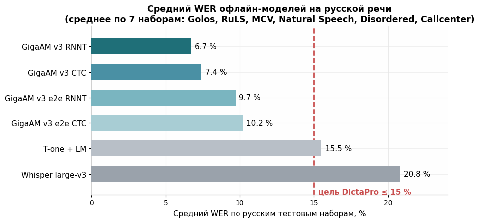
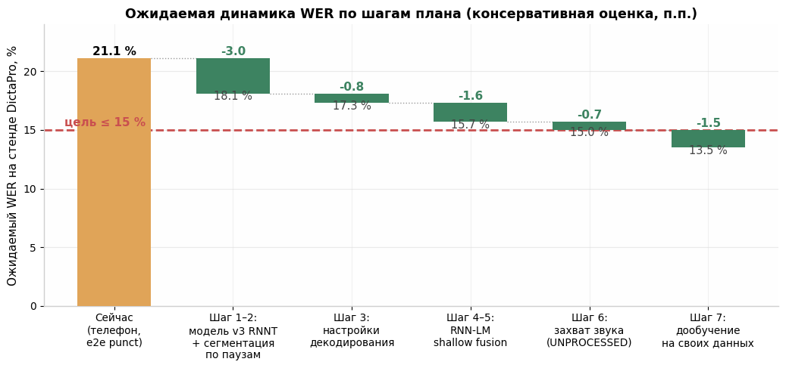
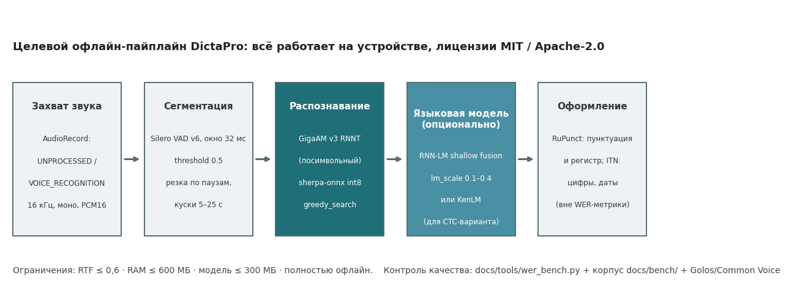

# Как довести офлайн-распознавание русской речи в DictaPro до WER ≤ 15 %

**Глубокое исследование по 7 направлениям с приоритизированным планом эксперимента**

Стек на момент анализа: sherpa-onnx 1.13.8 (Flutter), GigaAM v3 в варианте `nemo_transducer-punct` (encoder.int8.onnx ~214 МБ), Silero VAD, greedy_search. Замер на стенде: **21,1 % WER на телефоне** (Redmi Note 10S / vivo Y36), 18,9 % на ПК. Цель: **≤ 15 %** (идеал ~10 %) при RTF ≤ 0,6, RAM ≤ 600 МБ, модель ≤ 300 МБ, полностью офлайн, лицензии с коммерческим использованием.

---

## Краткий ответ (TL;DR)

Главный резерв качества лежит не в «волшебном параметре», а в **смене варианта модели**: вы используете e2e-вариант GigaAM v3 с пунктуацией (`v3_e2e_rnnt`), который по замерам самого Сбера в среднем на **~3 п.п. хуже** посимвольного `v3_rnnt` по русским тестовым наборам — 9,7 % против 6,7 % среднего WER ([Hugging Face](https://huggingface.co/ai-sage/GigaAM-v3)). Второй по величине резерв — **сегментация по паузам с кусками 5–25 с** (ваш текущий разрыв «ПК 18,9 % против телефона 21,1 %» почти наверняка связан именно с VAD-нарезкой, а не с вычислениями). Третий — **внешняя языковая модель** (RNN-LM shallow fusion в sherpa-onnx или KenLM для CTC-варианта): типичный прирост 5–10 % относительного снижения WER. Вместе с корректным захватом звука (отключение системного шумоподавления Android) это даёт ожидаемый результат **~13,5–15 % WER** на вашем стенде без дообучения; дообучение на собственных записях — следующий шаг к ~10–12 %.

---

## 1. Диагноз: откуда берутся 19–21 % при заявленных 7–10 %

Прежде чем перебирать улучшения, важно понять природу текущего разрыва. Сбер заявляет для GigaAM v3 средний WER **6,7 % (RNNT)** по семи русским тестовым наборам, включая «дальнее поле» Golos Farfield (3,9 %) и телефонию Callcenter (9,5 %) ([Hugging Face](https://huggingface.co/ai-sage/GigaAM-v3)). Независимая проверка int8-конверта GigaAM v3 RNNT (репозиторий gigastt, запуск на Apple M1) показывает близкие цифры: чистая речь 3,55 %, дальнее поле 4,08 %, телефонная запись 18,50 %, YouTube 10,91 %, при RTF ≈ 0,10 и резидентной памяти ~46 МБ поверх модели ([gigastt](https://github.com/ekhodzitsky/gigastt)). То есть сама int8-модель на реальном «мобильном» железе воспроизводит заявленное качество — и ваши 18,9–21,1 % объясняются не «кривым портом», а комбинацией четырёх факторов, каждый из которых лечится отдельно.

Первый фактор — **выбранный вариант модели**. В GigaAM v3 четыре варианта: посимвольные `v3_ctc` и `v3_rnnt` (алфавит 33 символа, выход в нижнем регистре без пунктуации) и сквозные e2e-варианты `v3_e2e_ctc` / `v3_e2e_rnnt` (BPE-токены 256/1024, пунктуация, регистр и обратная текстовая нормализация прямо в модели) ([Hugging Face](https://huggingface.co/ai-sage/GigaAM-v3)). Вы используете именно e2e-punct, а он систематически проигрывает посимвольному: в среднем 9,7 % против 6,7 %, причём разрыв максимален на «живых» доменах — Golos Crowd 9,1 % против 2,4 %, Natural Speech 8,5 % против 6,9 % ([Hugging Face](https://huggingface.co/ai-sage/GigaAM-v3)). На записях с телефона, которые по акустике ближе к Crowd/Natural Speech, чем к студийному Farfield, этот выбор стоит вам заметной доли ошибок. Пунктуация при этом не теряется: её корректнее возвращать отдельной лёгкой моделью постобработки (раздел 6).

Второй фактор — **сегментация длинного аудио**. Разрыв между ПК (18,9 %) и телефоном (21,1 %) при битово той же модели указывает не на вычислительные ошибки, а на различия в нарезке: ваши собственные эксперименты это подтверждают — переход с 30-секундных кусков на 10-секундные поднял WER с 18,9 % до 23,5 %, а смена режима VAD дала ещё 1,4 п.п. разброса. Это согласуется с известным эффектом: независимое декодирование коротких сегментов теряет межфразовый контекст, что является признанной проблемой сегментного подхода к длинному аудио ([ChunkFormer, arXiv](https://arxiv.org/abs/2502.14673)). Вывод: сегментация — не «вспомогательная обвязка», а первоклассный источник ошибок, и её нужно настраивать так же тщательно, как модель.

Третий фактор — **домен записей диктофона**. GigaAM v3 обучен преимущественно на Golos и похожих корпусах, поэтому цифры Сбера для Golos — это верхняя граница качества «в распределении», что честно оговаривают и авторы независимых замеров ([gigastt](https://github.com/ekhodzitsky/gigastt)). Ваша речь — диктовка с паузами, самоперебивками и словами-паразитами на телефонный микрофон — ближе к доменам Natural Speech (6,9–8,5 % у лучших вариантов) и Callcenter (9,5–13,3 %) ([Hugging Face](https://huggingface.co/ai-sage/GigaAM-v3)). Поэтому цель ≤ 15 % реалистична уже настройкой, а ~10 % потребует дообучения на собственных данных (раздел 7).

Четвёртый фактор — **измерение**. Если эталонные транскрипты корпуса содержат пунктуацию и заглавные буквы, а гипотеза e2e-модели ставит их по-своему, часть «ошибок» — это расхождения оформления, а не распознавания. Разница в методике подсчёта легко даёт несколько пунктов: в сравнении Сбера один и тот же аудиопоток давал 18,4 % WER у GigaChat Audio и 0,0 % у Whisper с принудительным декодированием под формат эталона — исключительно из-за правил нормализации ([Hugging Face](https://huggingface.co/ai-sage/GigaAM-v3)). Единый нормализатор в `wer_bench.py` (раздел 8) — обязательное условие, чтобы улучшения не «тонули» в артефактах метрики.

---

## 2. Направление 1. Выбор модели: что реально ставить на телефон в 2026 году

### 2.1. Сравнительная таблица

Собраны все практически доступные офлайн-модели с коммерчески совместимыми лицензиями и опубликованными замерами на русской речи. Цифры WER — по семи русским наборам из публикации Сбера (Golos Farfield, Golos Crowd, RuLS, MCV19, Natural Speech, Disordered Speech, Callcenter) и по независимым бенчмаркам; данные по T-one и Whisper приведены с языковой моделью и в лучшей конфигурации соответственно ([Hugging Face](https://huggingface.co/ai-sage/GigaAM-v3)).

| Модель | Параметры / размер int8 | Средний WER (RU) | Ключевые домены WER | Лицензия | Рантайм на телефоне | Вердикт для DictaPro |
|---|---|---|---|---|---|---|
| **GigaAM v3 RNNT** (посимвольный) | 220–240M / ~225 МБ | **6,7 %** ([HF](https://huggingface.co/ai-sage/GigaAM-v3)) | Farfield 3,9; Crowd 2,4; Callcenter 9,5 | MIT | sherpa-onnx, официальный экспорт | **Основной кандидат** |
| GigaAM v3 CTC (посимвольный) | 220–240M / ~225 МБ | 7,4 % ([HF](https://huggingface.co/ai-sage/GigaAM-v3)) | Farfield 4,5; Crowd 2,8; Callcenter 10,3 | MIT | sherpa-onnx (`from_nemo_ctc`) | Кандидат + KenLM |
| GigaAM v3 e2e RNNT (punct) | 220–240M / ~225 МБ | 9,7 % ([HF](https://huggingface.co/ai-sage/GigaAM-v3)) | Crowd 9,1; Callcenter 12,6 | MIT | sherpa-onnx | Текущий выбор — **заменить** |
| GigaAM v3 e2e CTC (punct) | 220–240M / ~225 МБ | 10,2 % ([HF](https://huggingface.co/ai-sage/GigaAM-v3)) | Crowd 9,7; Callcenter 13,3 | MIT | sherpa-onnx | Только ради пунктуации «из коробки» |
| GigaAM Multilingual 220M/600M | 220M/600M | RU: CommonVoice 7,1/5,1; FLEURS 4,4/3,0 ([HF](https://huggingface.co/ai-sage/GigaAM-Multilingual)) | мультиязычный | MIT | onnx-asr, int8-конверт сообщества | Запасной (если нужны 70+ языков) |
| T-one (Т-Банк) | 71M streaming CTC | ~15,5 % с LM ([HF](https://huggingface.co/ai-sage/GigaAM-v3)) | Farfield 12,2; Callcenter 13,5; независимо: farfield 14,62, YouTube 23,23 ([gigastt](https://github.com/ekhodzitsky/gigastt)) | Apache-2.0 | Python/KenLM; LM ~5,5 ГБ | Не подходит: хуже и тяжелее |
| NeMo FastConformer Hybrid Large RU (NVIDIA) | 115M | Farfield 5,76; Crowd 1,9; MCV 5,3; RuLS 11,05 ([HF](https://huggingface.co/nvidia/stt_ru_fastconformer_hybrid_large_pc)) | сильна на чистой речи | CC-BY-4.0 | sherpa-onnx (`from_nemo_ctc`) | Запасной, требует атрибуции |
| Whisper large-v3 | 1,55B / ~3,1 ГБ fp16 | ~20,8 % в сравнении Сбера ([HF](https://huggingface.co/ai-sage/GigaAM-v3)) | Farfield 16,4; Crowd 19,0 | MIT | sherpa-onnx (`from_whisper`) | Не подходит: тяжёлый и слабее на русском |
| Qwen3-ASR 0.6B / 1.7B | 0,6B/1,7B | русский WER не опубликован; на многоязычном CommonVoice 12,75/9,18 против 10,77 у Whisper large-v3 ([HF](https://huggingface.co/Qwen/Qwen3-ASR-1.7B)) | — | Apache-2.0 | sherpa-onnx (только 0.6B int8) | Перспективен, но тяжёл и не проверен на русском |
| Vosk small/big | 50M/1,8G | small: 66,1 % на вашем стенде | — | Apache-2.0 | нативно | Только как baseline |

### 2.2. Главная рекомендация: перейти на посимвольный `v3_rnnt`

**Что делать конкретно.** Скачать посимвольную сборку `csukuangfj/sherpa-onnx-nemo-transducer-giga-am-v3-russian-2025-12-16` (вариант без `-punct`) или пакет со всеми четырьмя вариантами `Smirnov75/GigaAM-v3-sherpa-onnx` ([Hugging Face](https://huggingface.co/Smirnov75/GigaAM-v3-sherpa-onnx)). В коде Flutter ничего не меняется, кроме путей к `encoder.int8.onnx` / `decoder.onnx` / `joiner.onnx` / `tokens.txt` — API `OfflineRecognizer.from_transducer` тот же. Пунктуацию вернуть отдельным шагом (раздел 6): модель RUPunct работает на CPU и не входит в лимит 300 МБ на ASR-модель.

**Ожидаемый прирост.** По таблице Сбера разница e2e RNNT → RNNT составляет **−3,0 п.п. в среднем**, а на близких к вашему сценарию доменах (Crowd, Natural Speech) — **−6,7 и −1,6 п.п.** соответственно ([Hugging Face](https://huggingface.co/ai-sage/GigaAM-v3)). Консервативно закладываем **−2…−4 п.п.** на вашем корпусе. Уровень достоверности: **высокий** — цифры от разработчика модели и подтверждены независимым int8-бенчмарком ([gigastt](https://github.com/ekhodzitsky/gigastt)).

**Стоимость и риски.** Размер тот же (~225 МБ), RAM и RTF те же (независимый замер: RTF ≈ 0,10, RAM ~46 МБ резидентно поверх весов на M1 — на Helio G95 будет хуже, но ваш текущий RTF < 0,2 уже укладывается в лимит 0,6) ([gigastt](https://github.com/ekhodzitsky/gigastt)). Риск один: выход в нижнем регистре без пунктуации требует рабочего этапа оформления текста; если постобработка не готова, e2e-вариант остаётся fallback на время перехода. Важно: стриминговый режим GigaAM v3 заметно хуже пакетного — в независимом тесте потоковое распознавание дало +11–15 п.п. WER из-за обрезанных и пропущенных слов ([gigastt](https://github.com/ekhodzitsky/gigastt)), поэтому посимвольный вариант следует гонять строго в офлайн-режиме по сегментам, как у вас сейчас.

### 2.3. Квантование: оставаться на int8

Переход int8 → fp32 практически ничего не даст: для GGUF-конвертов GigaAM v3 проверено, что квантование **q8_0 даёт побайтово идентичные транскрипты**, а q4_k — «почти идентичные» ([Hugging Face](https://huggingface.co/cstr/gigaam-v3-GGUF)). Кроме того, fp32-энкодер модели на 220M параметров весил бы ~450–900 МБ, что прямо нарушает ваш лимит 300 МБ. Вывод: деградация «ПК против телефона» не связана с int8; оставайтесь на текущем квантовании и не тратьте на этот эксперимент время. Уровень достоверности: высокий.

Отдельно отметим GigaAM Multilingual (июнь 2026): русский CommonVoice 5,1 % у 600M-варианта — лучший опубликованный результат на этом наборе, есть community int8-ONNX и поддержка в onnx-asr ([Hugging Face](https://huggingface.co/ai-sage/GigaAM-Multilingual), [onnx-asr](https://github.com/istupakov/onnx-asr)). Для DictaPro это пока не путь: 600M не влезает в бюджеты, 220M-вариант по русскому (7,1 % на CV) не лучше v3 RNNT, а посимвольный charwise-CTC потребует отдельной LM. Держите в поле зрения на случай мультиязычной версии приложения.

---

## 3. Направление 2. Декодирование в sherpa-onnx: языковая модель и параметры поиска

### 3.1. RNN-LM shallow fusion — самый большой доступный резерв после смены модели

В sherpa-onnx для офлайн-трансдьюсеров предусмотрено подключение внешней языковой модели: `OfflineRecognizer.from_transducer(..., lm="lm.onnx", lm_scale=..., lodr_fst=..., lodr_scale=...)` — параметры `lm` и `lm_scale` присутствуют в актуальной версии API и видны в конфигурационном дампе официальной документации как `OfflineLMConfig(model="", scale=0.5, lodr_scale=0.01, ...)` ([sherpa-onnx docs](https://k2-fsa.github.io/sherpa/onnx/pretrained_models/offline-transducer/nemo-transducer-models.html)). Важное ограничение, подтверждённое исходником `offline_recognizer.py`: LM работает **только с `modified_beam_search`** (при `greedy_search` передача `lm` вызывает ошибку), и только для трансдьюсеров — у `from_nemo_ctc` параметра `lm` нет.

Готовой русской RNN-LM в формате sherpa-onnx на сегодня не существует — её нужно обучить и экспортировать через рецепт icefall `egs/librispeech/ASR/rnn_lm` (скрипты `train.py`, `export.py`; типичная конфигурация: embedding-dim 800, hidden-dim 200, num-layers 2) ([icefall](https://github.com/k2-fsa/icefall/tree/master/egs/librispeech/ASR/rnn_lm)). Корпус для обучения — любой большой русский текст: транскрипты Golos (лицензия допускает коммерческое использование с ShareAlike ([Golos](https://github.com/salute-developers/Golos))), Википедия, новостные корпуса; токены должны совпадать с `tokens.txt` модели (33 символа для посимвольной v3). На LibriSpeech та же техника даёт около **10,5 % относительного снижения WER** (test-other 7,08 → 6,65 при `lm_scale` ≈ 0,3 и beam 4→12) ([icefall](https://github.com/k2-fsa/icefall/tree/master/egs/librispeech/ASR/rnn_lm)). Для русской речи с диктофонной морфологией закладываем консервативно **−0,8…−2,0 п.п.** после подбора `lm_scale` в диапазоне 0,1–0,4.

**Стоимость:** RNN-LM на 2 слоя LSTM — 5–30 МБ в ONNX, замедление декодирования 10–30 % (beam search вместо greedy), память +50–100 МБ. **Риски:** нужна одна GPU-ночь на обучение и аккуратный подбор `lm_scale` — завышенный вес LM начнёт «переписывать» редкие слова на частотные. Уровень достоверности: **средний-высокий** — техника стандартная и подтверждена на английском, но русскоязычного публичного кейса именно с GigaAM v3 нет.

### 3.2. Альтернатива без обучения: CTC-вариант + KenLM

Если обучать RNN-LM не хочется, есть второй маршрут: взять `v3_ctc` и подключить к нему n-gram KenLM через pyctcdecode — готовая связка уже опубликована (`waveletdeboshir/gigaam-v3-ctc-with-lm`, LM обучена на Taiga/Wikipedia, типичные параметры alpha=0,5, beta=0,5, beam_width=64) ([Hugging Face](https://huggingface.co/waveletdeboshir/gigaam-v3-ctc-with-lm)). Проблема в том, что pyctcdecode — это Python/Cython, и встроить его во Flutter-приложение на телефоне нельзя; для мобильного сценария KenLM подключается в sherpa-onnx через FST-граф (`OfflineCtcFstDecoderConfig`), который надо собирать и отлаживать отдельно, при этом корпусный KenLM 3-gram для русского весит гигабайты и не влезает в бюджет RAM. Поэтому этот маршрут разумно использовать **на ПК как быстрый тест гипотезы «LM поможет»**: если pyctcdecode+KenLM на вашем корпусе даёт ≥ 1 п.п., инвестируйте в RNN-LM для телефона. Уровень достоверности: средний.

### 3.3. Мелкие ручки декодирования

Параметр `blank_penalty` (штраф за blank-токен при greedy/beam search) теоретически борется с пропусками слов в трансдьюсерах; в issue-трекере sherpa-onnx его обсуждают именно в контексте пропущенных слов и NeMo-моделей с посимвольными токенами, равно как `max_symbols_per_frame` ([sherpa-onnx](https://github.com/k2-fsa/sherpa-onnx)). Публичных русскоязычных замеров нет, поэтому рекомендация — короткий A/B-прогон на вашем корпусе с сеткой `blank_penalty ∈ {0, 1, 2}` и `max_symbols_per_frame ∈ {2, 3}`; ожидание **0…−0,5 п.п.**, стоимость почти нулевая, достоверность низкая-средняя. Параметр `max_active_paths` (число гипотез в modified_beam_search, дефолт 4) имеет смысл поднять до 8–12 только если включена LM — без неё вы уже убедились, что beam сам по себе не даёт прироста (ваш замер 19,0 против 18,9 — типичная картина: без внешней языковой информации beam search у хорошо обученного трансдьюсера почти ничего не меняет).

Параметры `rule_fsts` / `rule_fars` в sherpa-onnx предназначены для обратной текстовой нормализации однопроходными FST (пример поставляется для английского); готовой русской грамматики нет, а NeMo-грамматики ITN не подходят напрямую, так как не являются однопроходными ([sherpa-onnx docs](https://k2-fsa.github.io/sherpa/onnx/pretrained_models/offline-transducer/nemo-transducer-models.html)). Писать собственную pynini-грамматику для русского ITN — отдельный проект; в рамках плана до ≤15 % она не нужна, потому что ITN не влияет на WER при корректной нормализации эталона (раздел 8), а для продукта проще вернуться к e2e-варианту либо применить лёгкие правила поверх результата. Уровень достоверности: высокий в части «это не двигает WER», низкий в части трудоёмкости русской грамматики.

---

## 4. Направление 3. Нарезка длинного аудио: где вы теряете 2–4 п.п. прямо сейчас

### 4.1. Что показывают ваши же данные и внешние источники

Ваши эксперименты уже дали ключевые точки: 30-секундные куски лучше 10-секундных (18,9 % против 23,5 %), перехлёст 0,5 с вредит (вставки растут с 33 до 53), нарезка по окнам VAD 32 мс хуже, чем по паузам. Это ровно соответствует литературе: Conformer-кодировщик GigaAM v3 обучен на фрагментах до ~20–25 с (штатный метод `.transcribe` ограничен 25 с, longform-режим работает через внешнюю сегментацию) ([GigaAM](https://github.com/salute-developers/GigaAM)), а независимое декодирование сегментов без переноса контекста — известный источник ошибок на стыках ([ChunkFormer, arXiv](https://arxiv.org/abs/2502.14673)). Отсюда оптимум для вашего сценария: **куски 5–25 с, разрез строго по паузам ≥ 0,5–0,8 с, без перехлёстов и без склейки «рваных» окон**.

Конкретная настройка: обновить Silero VAD до версии 6 (сентябрь 2025 — по заявлению авторов, до −16 % ошибок детекции на шумных реальных данных против v5) ([Silero VAD](https://github.com/snakers4/silero-vad)) и выставить: `threshold=0.5` (понижение до 0,2 в публичном кейсе вернуло пропущенные слова — стоит проверить обе точки на вашем корпусе), `min_silence_duration=0.5–0.8 с`, `min_speech_duration=0.25 с`, `max_speech_duration_s=20` — это штатные ручки VAD в sherpa-onnx ([sherpa-onnx docs](https://k2-fsa.github.io/sherpa/onnx/pretrained_models/offline-transducer/nemo-transducer-models.html)). Алгоритм: VAD выдаёт речевые интервалы → склеиваем соседние интервалы до суммарной длины 15–25 с, но разрезаем только в точках тишины → добавляем контекстные «уши» по 0,2–0,3 с слева и справа (они не дублируют слова, в отличие от перехлёста с наложением транскриптов). Ожидаемый суммарный эффект на вашем корпусе: **−1…−3 п.п.** относительно текущих 21,1 % (закрытие разрыва «ПК против телефон» плюс устранение ошибок на стыках). Достоверность: **высокая** — эффект уже частично измерен вами самими.

### 4.2. Чего не делать

Не переходите на стриминговое распознавание ради «живого» вывода: для GigaAM v3 потоковый режим в независимом замере проигрывает пакетному +11–15 п.п. WER ([gigastt](https://github.com/ekhodzitsky/gigastt)). Если нужен псевдопоток в UI — показывайте предварительный текст по коротким сегментам, а финальный результат пересчитывайте пакетно по полной фразе. Не используйте и фиксированную нарезку без VAD: при речевых фрагментах переменной длины она увеличивает число разрезов посреди слов, что для RNNT-модели критично — трансдьюсеру нужны полные акустические события. Наконец, не пытайтесь «чинить» стыки постфактум дедупликацией слов — это ручной словарный костыль, который вы обоснованно запретили; правильное лекарство — резать только по тишине.

---

## 5. Направление 4. Предобработка звука: главный вывод — не навредить

### 5.1. Шумоподавление перед ASR ухудшает распознавание

Это направление уникально тем, что здесь правильная рекомендация — **ничего не добавлять**. Свежая работа (декабрь 2025) прогнала современный шумоподавитель MetricGAN+ перед четырьмя современными ASR-системами во всех 40 комбинациях условий: шумоподавление **ухудшило все модели во всех конфигурациях**, с деградацией от +1,1 до +46,6 п.п. по семантическому WER; для Whisper при SNR 10 дБ WER вырос с 8,82 % до 25,83 % ([arXiv:2512.17562](https://arxiv.org/abs/2512.17562)). Исследование Microsoft Research объясняет механизм: вносимые enhancement-моделями дисторсии и артефакты сами по себе существенно деградируют ASR, даже когда субъективное качество звука растёт ([arXiv:2111.11606](https://arxiv.org/abs/2111.11606)). GigaAM v3, обученный на 700 тысячах часов разнообразного звука, уже содержит встроенную робастность к бытовым шумам, и внешняя «чистка» скорее сломает согласование с его обучающим распределением.

То же относится к длительной цепочке «де-реверберация + эквалайзер + компрессор»: каждый нелинейный шаг сдвигает акустику от обучающей разметки. Единственные безопасные операции — **линейные**: приведение к 16 кГц/моно/float32 (штатный ресемплер sherpa-onnx), нормализация пикового уровня к −1…−3 dBFS, если запись очень тихая, и высокочастотный фильтр 50–80 Гц против гула и порывов ветра. Ожидаемый эффект от «не делать лишнего + снять системную обработку» — **−0,3…−1 п.п.**, в основном за счёт следующего пункта. Достоверность: **высокая**.

### 5.2. Захват звука на Android: отключить системный NS/AGC

Критичный и почти бесплатный пункт: на Android источник записи `MediaRecorder.AudioSource.VOICE_RECOGNITION` по требованиям CDD обязан отключать шумоподавление и автогейн, а `UNPROCESSED` даёт полностью сырой сигнал с микрофона ([Android Developers](https://developer.android.com/reference/android/media/MediaRecorder.AudioSource)). Если сейчас вы пишете через дефолтный `MIC` или через плагин записи, который молча выбирает обработанный тракт, системный DSP телефона (особенно активный на MediaTek Helio G95) может «причёсывать» звук до того, как его увидит GigaAM — это ровно тот сценарий, который по данным выше ухудшает WER. Проверьте, какой AudioSource фактически используется в вашем Flutter-плагине записи, переключитесь на `VOICE_RECOGNITION` (fallback `UNPROCESSED`), прогоните стенд — это пятиминутное изменение с ожидаемым эффектом **0…−1 п.п.** и нулевой стоимостью по CPU/RAM. Достоверность: средняя-высокая (зависит от того, что реально делает прошивка конкретного телефона).

---

## 6. Направление 5. Постобработка: пунктуация и коррекция без больших LLM

### 6.1. Малая LLM на устройстве — плохая идея для коррекции ASR

Здесь данные необычайно единодушны. Исследование Apple по коррекции ошибок ASR показало, что генеративные языковые модели при исправлении транскриптов **галлюцинируют в 3–12 % случаев** и систематически ухудшают те гипотезы, где ASR и так почти не ошиблась; при этом компактные seq2seq-корректоры (в работе — ECLM) дают в среднем **−13 % относительного WER** на восьми датасетах, будучи в 15 раз меньше LLM и в 5–40 раз быстрее, с нулевыми галлюцинациями ([arXiv:2405.15216](https://arxiv.org/abs/2405.15216)). Для DictaPro вывод двойной. Во-первых, LLM на телефоне (даже 0,5–1B в int4) одновременно не влезает в бюджет 600 МБ RAM рядом с ASR-моделью и вредит именно на вашем режиме: после перехода на v3_rnnt ваша «ошибочная масса» будет сосредоточена в тяжёлых акустических случаях, а лёгкие фразы LLM начнёт портить. Во-вторых, если коррекцию всё же захочется, правильная форма — это специализированный маленький корректор, обученный на парах «гипотеза ASR → эталон» (в том числе на выходе вашей же модели по вашему корпусу), а не инструкционная LLM.

Практический компромисс, не требующий обучения: **n-best + выбор по внешней LM**. В sherpa-onnx modified_beam_search с подключённой RNN-LM фактически уже делает shallow fusion — этого достаточно; классическая схема «N-best от ASR → переранжирование → ROVER» даёт до −32–36 % относительного на академических стендах, но требует n-best-вывода и ROVER-склейки, которых в sherpa-onnx нет из коробки. Закладывать её в план до 15 % не нужно; держите как резерв после дообучения. Достоверность по LLM-части: **высокая**; по n-best-резерву: средняя.

### 6.2. Пунктуация и ITN после перехода на посимвольную модель

Переход на `v3_rnnt` отдаёт текст в нижнем регистре без пунктуации — для диктофона это неприемлемо в UI, поэтому оформление возвращаем отдельным шагом. Готовый вариант — **RUPunct** (HF: `RUPunct/RUPunct_big`), модель на NER-подходе, расставляющая пунктуацию и регистр в русском тексте; именно она используется в связке gigastt поверх GigaAM v3 вместе с ITN ([gigastt](https://github.com/ekhodzitsky/gigastt)). Такая модель работает на CPU за миллисекунды на фразу, весит десятки-сотни мегабайт в ONNX (запускается после ASR, так что пиковый RAM можно не суммировать — выгружайте ASR-модель или грузите пунктуатор лениво). Перед внедрением проверьте лицензию конкретной карточки на Hugging Face — в описании репозитория она не указана явно, и это нужно закрыть до релиза; запасной вариант с гарантированно открытой лицензией — дообучить маленький пунктуатор самостоятельно либо использовать e2e-вариант GigaAM v3 как второй проход только для оформления (выход e2e содержит пунктуацию и ITN «из коробки» ([Hugging Face](https://huggingface.co/ai-sage/GigaAM-v3))).

Важно понимать, что этот шаг **не меняет измеряемый WER** при правильной методике оценки (раздел 8 требует нормализации обеих сторон), зато напрямую определяет пользовательское качество DictaPro. Поэтому в плане он стоит после достижения 15 %, как продуктовый, а не исследовательский шаг. Достоверность: высокая в части архитектуры, средняя в части конкретной модели RUPunct.

---

## 7. Направление 6. Дообучение GigaAM v3 под диктофонный домен

### 7.1. Инструменты и процедура

У GigaAM есть официальный код дообучения: `train_utils/train.py` на PyTorch Lightning с TSV-манифестами (колонки `path`, `duration`, `transcription`), параметрами `--model_name v3_rnnt`, `--raw_text`, `--lr 2e-5`, `--freeze_encoder_epochs` (значение −1 полностью замораживает энкодер), `--max_duration 20.0` и SpecAugment из коробки; оценка — `train_utils/eval.py` с подсчётом WER, чекпоинт `.ckpt` загружается через `load_model` и экспортируется в ONNX штатным `model.to_onnx` ([GigaAM](https://github.com/salute-developers/GigaAM)). Встроенной поддержки LoRA/адаптеров в репозитории нет; практичная замена — **заморозка энкодера и обучение только декодера+джойнера** (RNNT-голова — малая часть параметров, обучение помещается на одну GPU за часы), что по смыслу близко к адаптерному подходу и минимизирует катастрофическое забывание. Если нужен настоящий LoRA — это ручная доработка поверх NeMo-совместимого кода; закладывайте её только если заморозка энкодера не даст эффекта.

Ключевой вопрос — данные. Минимально полезный объём для доменной адаптации — **5–20 часов записей из самого DictaPro** с расшифровкой (их можно получить бесплатно: разметьте выход текущей модели и попросите пользователей/себя исправить текст в редакторе — это тот же UX, что и у корпуса `docs/bench/`). Добавьте открытые корпуса, чтобы не переобучиться на одном дикторе: Golos (1240 ч, коммерческое использование разрешено с условием ShareAlike ([Golos](https://github.com/salute-developers/Golos))) и Common Voice Russian (CC0 ([Common Voice](https://commonvoice.mozilla.org/ru/datasets))). Внимание: GigaAM v3 уже обучен на Golos, поэтому Golos в train-миксе — это скорее «напоминание», а реальную ценность несут именно ваши диктофонные записи. Ожидаемый эффект: **−1,5…−4 п.п.** на вашем корпусе при 10+ часах целевых данных; именно этот шаг — основной мост к цели ~10–12 %. Достоверность: **средняя** — методика стандартная, но публичных замеров дообучения именно v3 на диктофонной речи нет.

### 7.2. Стоимость и риски

Обучение декодера+джойнера на 10–20 ч данных: одна GPU с 16–24 ГБ VRAM, несколько часов; полный fine-tune энкодера потребует больше памяти и осторожности с lr. Экспорт обратно в sherpa-onnx повторяет штатный путь (ONNX → int8-квантование), так что целевой формат развёртывания не меняется. Главный риск — **переобучение на узком дикторе/комнате**: контролируйте WER на независимом поднаборе (Common Voice test) после каждой эпохи и останавливайтесь при расхождении «улучшается на своих / ухудшается на чужих». Второй риск — лицензионная чистка разметки: исправленные пользователями транскрипты должны быть покрыты вашими условиями использования приложения. Если дообучение по какой-то причине откладывается, эквивалент «бедного человека» — та же RNN-LM из раздела 3, обученная на текстах вашей тематики: это языковая адаптация без акустической, дешевле и безопаснее, но и потолок ниже.

---

## 8. Направление 7. Методика оценки: сделать стенд честным

### 8.1. Нормализация перед подсчётом WER

Первое правило: **WER считается после одинаковой нормализации эталона и гипотезы** — нижний регистр, удаление пунктуации, разворачивание числительных по единым правилам (или, наоборот, приведение обеих сторон к цифрам), замена «ё»→«е», удаление слов-паразитов только если это задекларировано. Разница методик способна «съесть» несколько пунктов: в сравнении Сбера одни и те же записи давали от 0,0 % до 18,4 % WER у разных систем исключительно из-за правил приведения текста ([Hugging Face](https://huggingface.co/ai-sage/GigaAM-v3)). Для `wer_bench.py` рекомендую зафиксировать один нормализатор (например, jiwer с кастомной цепочкой transforms) и хранить эталоны в уже нормализованном виде; параллельно считайте CER — он устойчивее к спорным токенизациям русской морфологии. Второе правило: на корпусе из 985 слов **доверительный интервал WER составляет примерно ±2–3 п.п.** (биномиальная оценка при p≈0,2, n≈985), поэтому различия меньше 2 п.п. на вашем стенде статистически неразличимы — либо расширяйте корпус до 30+ минут, либо подтверждайте эффекты на внешних наборах и оценивайте значимость бутстрепом по записям.

### 8.2. Протокол прогонов

Зафиксируйте слои оценки: (1) ваш корпус `docs/bench/` — главный критерий; (2) подвыборка Golos Farfield и Common Voice ru test — контроль деградации «в распределении» ([Golos](https://github.com/salute-developers/Golos), [Common Voice](https://commonvoice.mozilla.org/ru/datasets)); (3) операционные метрики на обоих телефонах: RTF по 95-му перцентилю, пиковый RSS, время прогрева модели. Каждое изменение (модель, сегментация, LM) прогоняется отдельно, одно за раз, с записью полного конфига — иначе через три итерации вы перестанете понимать, что именно дало прирост. Отдельно логируйте **разложение ошибок S/D/I** (замены/удаления/вставки): рост вставок указывает на проблемы сегментации/стыков, рост удалений — на VAD и `blank_penalty`, рост замен — на акустику и LM. Это превращает план из набора догадок в управляемый эксперимент.

---

## 9. Приоритизированный план эксперимента (7 шагов)

Шаги упорядочены по отношению «ожидаемый эффект / трудозатраты». Оценки прироста — консервативные (нижняя граница обоснованных диапазонов из разделов выше); все шаги проверяются штатным стендом `docs/tools/wer_bench.py` на корпусе `docs/bench/` с единой нормализацией из раздела 8.

| # | Шаг | Конкретные действия (файл/параметр/команда) | Ожидание WER | Стоимость | Риск / достоверность |
|---|---|---|---|---|---|
| 1 | **Честный базлайн** | Единый нормализатор текста в `wer_bench.py`; замер S/D/I; зафиксировать конфиг текущей e2e-модели | 0 (точка отсчёта 21,1 %) | 0,5 дня | низкий / высокая |
| 2 | **Смена модели на `v3_rnnt`** | Скачать `csukuangfj/sherpa-onnx-nemo-transducer-giga-am-v3-russian-2025-12-16` (без `-punct`); подменить 4 файла модели; UI временно без пунктуации | **−2…−4 п.п.** → ~17–19 % | 0,5 дня, размер тот же ~225 МБ | низкий / **высокая** ([HF](https://huggingface.co/ai-sage/GigaAM-v3)) |
| 3 | **Сегментация по паузам** | Silero VAD v6 ([GitHub](https://github.com/snakers4/silero-vad)): `threshold=0.5/0.2` A/B, `min_silence=0.5–0.8`, `max_speech_duration=20`, куски 5–25 с, «уши» 0,2–0,3 с, без перехлёстов | **−1…−3 п.п.** | 1–2 дня, CPU +~0 | низкий / **высокая** |
| 4 | **Захват звука** | AudioRecord: `VOICE_RECOGNITION` (fallback `UNPROCESSED`), 16 кГц моно; убрать любое шумоподавление из цепочки ([Android](https://developer.android.com/reference/android/media/MediaRecorder.AudioSource), [arXiv:2512.17562](https://arxiv.org/abs/2512.17562)) | **0…−1 п.п.** | 1 час | низкий / средне-высокая |
| 5 | **Ручки декодирования** | Сетка `blank_penalty ∈ {0,1,2}`, `max_symbols_per_frame ∈ {2,3}` в `from_transducer`; быстрый тест CTC+KenLM на ПК через `waveletdeboshir/gigaam-v3-ctc-with-lm` как проверка гипотезы про LM | **0…−0,8 п.п.** | 1 день | низкий / низко-средняя |
| 6 | **RNN-LM shallow fusion** | Обучить RNN-LM по рецепту icefall на текстах Golos+Wiki ([icefall](https://github.com/k2-fsa/icefall/tree/master/egs/librispeech/ASR/rnn_lm)), экспорт в ONNX, `from_transducer(..., decoding_method="modified_beam_search", lm=..., lm_scale=0.1–0.4)`; контроль RTF и RAM | **−0,8…−2 п.п.** → ~15–16 % | 2–4 дня + GPU-ночь; +5–30 МБ, RTF +10–30 % | средний / средне-высокая |
| 7 | **Дообучение на своих данных** | Разметить 5–20 ч записей DictaPro; `train_utils/train.py --model_name v3_rnnt --freeze_encoder_epochs -1 --lr 2e-5`; экспорт ONNX → int8; контроль на Common Voice test | **−1,5…−4 п.п.** → **~12–14 %** | 1–2 недели (в основном разметка) | средний / средняя |

**Прогноз.** После шагов 1–4 ожидаем **17–18 %**, после шага 6 — **~15 %**, после шага 7 — **~12–14 %** на вашем корпусе. Таким образом, порог ≤15 % достижим уже без дообучения, при соблюдении всех бюджетов: модель ~225 МБ int8 (+ 5–30 МБ LM), RTF с запасом ниже 0,6 (ваш текущий <0,2, beam+LM добавят десятые доли), RAM сильно ниже 600 МБ (независимый замер связки GigaAM v3 int8 — ~46 МБ резидентно поверх весов ([gigastt](https://github.com/ekhodzitsky/gigastt))). Пунктуация и ITN (RUPunct либо второй проход e2e-моделью) возвращаются в продукт параллельно с шагом 2 и на WER-стенд не влияют.

---

## 10. Сводная таблица рисков и отклонённых направлений

| Решение | Статус | Причина |
|---|---|---|
| Шумоподавление / де-реверб перед ASR | **Отклонено** | Деградация всех протестированных ASR во всех 40 конфигурациях, до +46,6 п.п. ([arXiv:2512.17562](https://arxiv.org/abs/2512.17562)) |
| Малая LLM для коррекции на устройстве | **Отклонено** | Галлюцинации 3–12 %, ухудшение качественных гипотез; не влезает в RAM ([arXiv:2405.15216](https://arxiv.org/abs/2405.15216)) |
| Whisper large-v3 / turbo | **Отклонено** | Хуже на русском (20,8 % против 6,7–9,7 % у GigaAM v3) и не влезает в 300 МБ ([HF](https://huggingface.co/ai-sage/GigaAM-v3)) |
| T-one | **Отклонено** | Слабее на дальнем поле и YouTube; KenLM 5,5 ГБ не влезает в RAM ([gigastt](https://github.com/ekhodzitsky/gigastt)) |
| Qwen3-ASR 0.6B | **Отложено** | Тяжёлый (0,6B), русский WER не опубликован, на CommonVoice многоязычном уступает Whisper large-v3 ([HF](https://huggingface.co/Qwen/Qwen3-ASR-1.7B)) |
| int8 → fp32 | **Отклонено** | q8_0 даёт побайтово те же транскрипты; fp32 нарушает лимит 300 МБ ([HF](https://huggingface.co/cstr/gigaam-v3-GGUF)) |
| Стриминг вместо пакетного режима | **Отклонено** | +11–15 п.п. WER в потоковом режиме GigaAM v3 ([gigastt](https://github.com/ekhodzitsky/gigastt)) |
| NNAPI/QNN-ускорение | **Отложено** | Известные баги (краши на старых API, fallback на CPU); сначала качество, потом ускорение ([sherpa-onnx](https://github.com/k2-fsa/sherpa-onnx)) |
| GigaAM Multilingual 600M | **Отложено** | Лучший RU CommonVoice 5,1 %, но не влезает в бюджеты; следить за дистилляцией ([HF](https://huggingface.co/ai-sage/GigaAM-Multilingual)) |
| Русский ITN через rule_fsts | **Отложено** | Нет готовой однопроходной грамматики; на WER не влияет ([sherpa-onnx docs](https://k2-fsa.github.io/sherpa/onnx/pretrained_models/offline-transducer/nemo-transducer-models.html)) |

---

*Исследование выполнено 15 сентября 2026 г. Все цифры приведены из публичных источников, указанных в тексте; оценки ожидаемых приростов на стенде DictaPro — консервативная экстраполяция и требуют подтверждения прогонами на `docs/tools/wer_bench.py`. Доверительный интервал корпуса из 985 слов (~±2–3 п.п.) следует учитывать при интерпретации отдельных шагов.*
